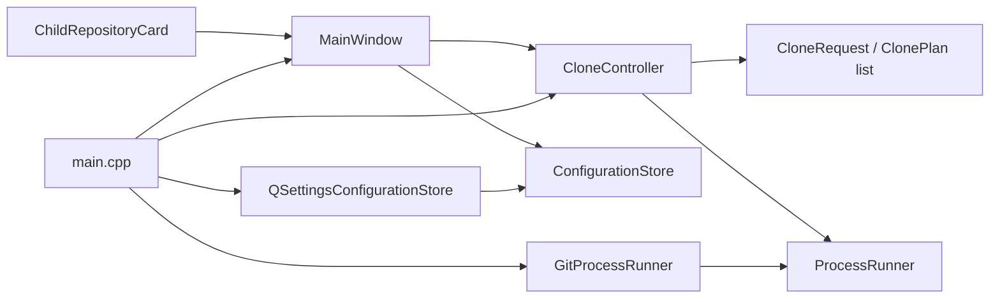
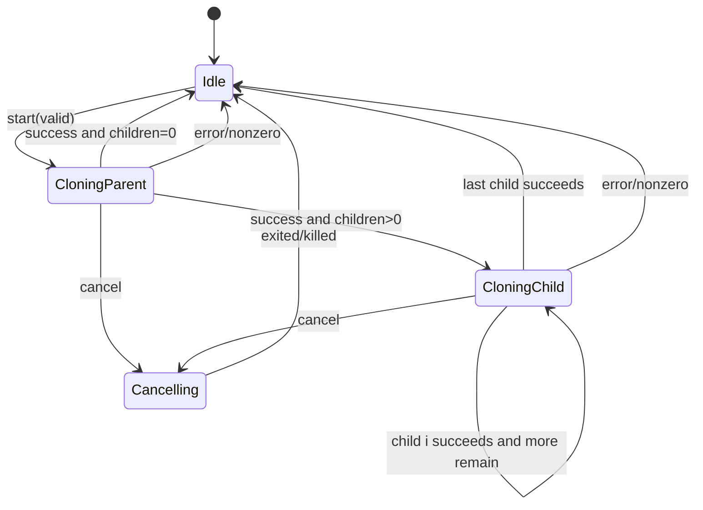
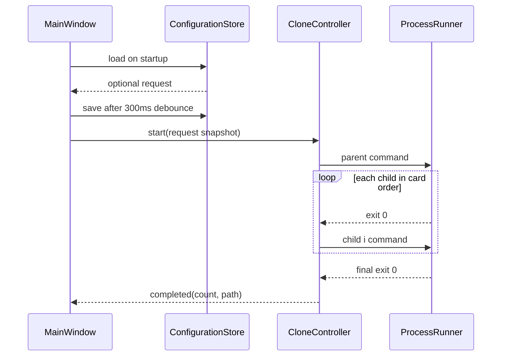

# 设计文档：git-clone-gui

> 阶段：design
>
> 工作流：requirements-first
>
> 设计深度：high
>
> 状态：已更新
>
> 最近更新：2026-08-11

## 设计摘要

- 目标：把工具交付为可保存配置、支持 0～N 子仓库、带正式图标且可自包含运行的现代 macOS 桌面应用。
- 覆盖行为：REQ-001～REQ-008。
- 核心方案：core 以列表生成命令计划；application 用索引驱动父阶段和子队列；infrastructure 继续封装 QProcess，并新增 QSettings 配置适配；presentation 拆出动态子仓库卡片并使用双栏卡片布局。
- 模块/构建边界：ARCH-001～ARCH-006 / BUILD-001～BUILD-005。

## 代码库调查

| 证据类型 | 证据 | 已验证事实 | 对设计的影响 |
|---|---|---|---|
| 当前结构 | `inspect_structure.py` | 23 个源文件；MainWindow 页面与 UI 构建已拆分；五层 target | 资源/部署继续归 app target，不改变分层 |
| 当前 core | `CloneRequest.h/.cpp` | 已使用 `QList<ChildRepositoryRequest/Plan>` | 本轮不修改 |
| 当前 application | `CloneController.cpp` | 已用 currentChildIndex 串行推进 0～N 子队列 | 本轮不修改 |
| 当前 presentation | snapshot、`MainWindow*.cpp` | 双栏卡片界面与集中 QSS 已完成 | 图标沿用其蓝色 “G” 视觉语言 |
| 当前 infrastructure | `GitProcessRunner`、`QSettingsConfigurationStore` | Git 与配置适配均已完成 | 本轮不修改 |
| 工具链 | CMake cache/既有回归 | Qt 5.15.2、macOS arm64 可构建 | 使用 Qt 5.15/6 公共 API |
| 当前 Bundle | `du`、`plutil`、`find`、`otool` | Debug 约 524 KB；`CFBundleIconFile` 为空；无 Resources/Frameworks/PlugIns | 现状只是开发构建物，不是最终部署产物 |
| 部署工具 | `/Users/qingyizhu/Qt5.15.2/bin/macdeployqt -h` | 当前 kit 的官方工具可收集 Framework 与插件 | 安装阶段调用对应 kit 工具生成自包含 Bundle |

### 工具链与兼容性基线

| 项目 | 已验证值 | 证据 | 设计结论 |
|---|---|---|---|
| OS/架构 | macOS 15.7.5 arm64 | `sw_vers`、`uname -m` | required 产物仍为 arm64 `.app` |
| 构建 | CMake 3.27.1、Ninja 1.11.1、Clang 17 | 版本命令 | Preset/输出路径不变 |
| Qt | Qt 5.15.2 已验证；Qt 6 兼容未原生验证 | CMake cache | 仅用 Core/Widgets/QSettings 公共 API |
| macOS 部署 | `macdeployqt` 来自当前 Qt 5.15.2 kit | 工具帮助与 qmake query | Release 安装树可原生部署并验证 self-contained |

## 约束与设计原则

- 保留 `program + QStringList arguments`，预览与执行分离。
- 子仓库列表是有序值对象；运行时复制快照，UI 后续变化不影响任务。
- presentation 只依赖 application/core 契约，不直接 include QProcess 或具体 QSettings 类。
- QSettings 只保存表单字段和 schemaVersion，不保存日志、任务状态或凭据对象。
- MainWindow 负责页面级布局/状态，单卡字段、标题、删除事件归 `ChildRepositoryCard`。
- 不引入 QML、第三方主题库、拖拽排序或破坏性目录清理。
- 图标保留 SVG 源文件并提交生成的 `.icns`；开发 Bundle 可保持轻量，安装树才执行 Qt runtime 部署。

## 方案比较

| 方案 | 需求覆盖 | 优点 | 代价与风险 | 结论 |
|---|---|---|---|---|
| A：Qt Widgets 自定义卡片 + QSS + QSettings | 全覆盖 | 不增依赖、Qt 5/6 兼容、可复用既有逻辑 | QSS 需要视觉回归 | 采用 |
| B：迁移 QML | 全覆盖 | 动态列表和动画方便 | 重写表示层、部署增加 QtQuick，范围过大 | 否决 |
| C：MainWindow 内动态创建全部字段并直接 QSettings | 功能覆盖 | 初始文件少 | MainWindow 膨胀、依赖反转、难测试 | 否决 |
| D：每次 POST_BUILD 都运行 `macdeployqt` | REQ-008 | build tree 立即自包含 | 每次增量构建都复制/改写 Framework，慢且污染开发产物 | 否决 |
| E：安装阶段运行当前 kit 的 `macdeployqt` | REQ-008 | 区分开发与部署产物，符合 CMake install 语义 | 最终交付需多执行一次 install | 采用 |

### DEC-001：以结构化 QProcess 参数执行 Git

- 上下文与需求：REQ-002、REQ-003、NFR-001。
- 决策：沿用 `ProcessRunner::start(ProcessCommand)` 和 `QProcess::start(program, arguments)`。
- 理由：多子仓库只增加命令数量，不改变安全边界。
- 代价：预览单独 quoting。
- 被否决方案：shell/system/单字符串执行。

### DEC-002：状态机使用父阶段加有序子队列

- 上下文与需求：REQ-002、REQ-003、NFR-002。
- 决策：状态仍为 Idle/CloningParent/CloningChild/Cancelling；controller 额外持有 `currentChildIndex`，每次成功推进一项，0 项直接完成。
- 理由：避免状态枚举随子仓库数量扩张，且易用 fake runner 测试。
- 代价：状态文本必须携带 i/N 上下文。
- 被否决方案：为每个子仓库创建 controller 或并行克隆。

### DEC-003：Qt 6 优先、Qt 5.15 回退

- 上下文与需求：REQ-004、NFR-004。
- 决策：保留 versionless CMake 查找和公共 API。
- 理由：现有 Qt 5.15.2 验证环境稳定。
- 代价：不用 Qt 6 专属 UI/部署 API。
- 被否决方案：硬编码单一 Qt 路径。

### DEC-004：失败保留磁盘内容

- 上下文与需求：REQ-003。
- 决策：队列任一项失败/取消都停止且不删除文件。
- 理由：避免数据丢失。
- 代价：用户需手工处理部分目录。
- 被否决方案：自动递归清理。

### DEC-005：核心请求与计划采用有序列表

- 上下文与需求：REQ-001、REQ-002、REQ-005。
- 决策：`CloneRequest.children` 为 `QList<ChildRepositoryRequest>`；`ClonePlan.children` 为 `QList<ChildClonePlan>`，每项拥有 request 对应命令与绝对目标。
- 理由：保持输入顺序、单次校验、预览和队列执行使用同一事实源。
- 代价：现有单 child API 与测试需迁移。
- 被否决方案：在 UI 循环多次调用单 child controller。

### DEC-006：通过 application 存储契约注入 QSettings

- 上下文与需求：REQ-007、NFR-005、NFR-006。
- 决策：application 定义 `ConfigurationStore`（load optional / save bool）；infrastructure 实现 `QSettingsConfigurationStore`；composition 注入 MainWindow。
- 理由：UI 可用 fake store 测试，QSettings 不跨层泄漏。
- 代价：增加一个契约和适配器。
- 被否决方案：MainWindow 直接构造 QSettings、JSON 文件路径硬编码。

### DEC-007：双栏卡片式 Widgets 视觉系统

- 上下文与需求：REQ-005、REQ-006。
- 决策：左栏是可滚动配置区（父卡、子卡列表、添加按钮、目标卡）；右栏是固定执行区（摘要、预览、状态、日志、操作按钮）。统一浅色背景、白卡、12px 圆角、蓝色主色和等宽输出。
- 理由：控制窗口高度并建立视觉层级；动态列表不会挤压日志。
- 代价：需要 QWidget snapshot/人工视觉验证。
- 被否决方案：继续使用 QGroupBox 单列堆叠。

### DEC-008：应用图标使用可编辑 SVG 源与 Bundle `.icns`

- 上下文与需求：REQ-008 / AC-008.1、AC-008.2。
- 决策：在 `src/app/resources` 保存蓝色圆角 “G + Git 分支” SVG 源，使用能保留 alpha 的 macOS `sips` 直接渲染 RGBA 基图并生成 `GitCloneGui.icns`；CMake 将 `.icns` 标记为 `Resources` 并设置 `MACOSX_BUNDLE_ICON_FILE`。
- 理由：视觉与应用内品牌一致，源资产可维护，Finder/Dock 使用 macOS 原生图标格式。
- 代价：生成的 `.icns` 是二进制派生产物，需要在源图更新时重新生成；生成后必须检查 RGBA 与四角透明度，不能使用会合成白底的 thumbnail 路径。
- 被否决方案：仅在运行时设置 `QApplication::setWindowIcon`（不能可靠提供 Finder Bundle 图标）、只提交单尺寸 PNG。

### DEC-009：在安装阶段生成自包含 Bundle

- 上下文与需求：REQ-008 / AC-008.3、AC-008.4，NFR-007。
- 决策：配置时从当前 Qt CMake target/qmake 所在 bin 目录定位 `macdeployqt`；`cmake --install` 复制 `.app` 后执行该工具，收集 Qt Framework、plugins 并改写 install names。
- 理由：使用与实际链接版本一致的 Qt 官方部署工具，同时保持开发构建快速、轻量。
- 代价：安装 Bundle 明显变大；未签名部署会留下 ad-hoc/未签名限制。
- 被否决方案：手工复制 Framework/插件、硬编码 `/Users/...` 路径、对每次 build 执行部署。

## 总体架构



### 组件与职责

| 组件 | 职责与边界 | 输入/输出 | 相关需求 |
|---|---|---|---|
| `CloneRequest/ClonePlan` | 父字段、0～N 子列表、校验、命令计划、重复路径检查 | 表单值 → 有序计划/错误 | REQ-001, REQ-002 |
| `CloneController` | 父+子队列、当前索引、取消/结果 | plan + runner events → status/result | REQ-002, REQ-003 |
| `ConfigurationStore` | 持久化契约 | optional request / save result | REQ-007 |
| `QSettingsConfigurationStore` | schemaVersion、数组序列化、sync/status | QSettings ↔ CloneRequest | REQ-007 |
| `ChildRepositoryCard` | 单个子仓库字段、序号、删除信号、配置读写 | child value ↔ signals | REQ-005, REQ-006 |
| `MainWindow` | 双栏页面、卡片集合、摘要、预览、保存定时器 | 用户事件 ↔ controller/store | REQ-001, REQ-005～REQ-007 |
| `GitProcessRunner` | 单进程 QProcess 适配 | command ↔ async signals | REQ-002, REQ-003 |

## 模块与依赖边界

### ARCH-001：依赖向 core/application 契约收敛

- 决策：presentation → application/core；infrastructure → application/core；app 组合具体实现。
- 组合根：`src/app/main.cpp`。
- 禁止：presentation include QProcess/QSettings/具体 infrastructure；application include Widgets/具体适配器；core include Widgets/I/O。
- 验证：target link/include 扫描。

### ARCH-002：有序请求与路径不变量归 core

- 每个子请求分别校验 URL/分支/相对路径；错误带 1-based 卡片序号。
- 任一子目标必须严格位于父目录内；规范化目标不得重复。
- 0 个子项有效；计划顺序与输入顺序一致。
- 预览由同一 `ClonePlan` 生成。

### ARCH-003：单 runner 串行队列

- runner 同时最多一个进程；controller 只在 exit 0 后推进。
- currentChildIndex 仅在 CloningChild 有效；finish 时复位。
- 取消 timer 与旧实现一致。

### ARCH-004：表示层分为页面与单卡组件

- `ChildRepositoryCard` 只拥有单卡控件和序号，不访问 controller/store。
- MainWindow 拥有卡片集合、布局、预览、摘要、保存 debounce 和运行门控。
- 配置区内部滚动；右栏日志获得 stretch。

### ARCH-005：配置存储通过契约隔离

- `ConfigurationStore` 位于 application，仅以 `CloneRequest` 读写。
- QSettings key：`schemaVersion=1`、`parent/url|branch|directory`、`destinationRoot`、`children` array 的 url/branch/path。
- `load()` 仅在 schemaVersion 存在时返回值；因此首次启动和已保存 0 子项可区分。
- save 后 `sync()`，status 非 NoError 返回 false。

### ARCH-006：视觉样式集中管理

- QSS 由 presentation 内的 `AppStyle::applicationStyleSheet()` 单点提供；对象名/动态属性区分 card、primary、secondary、danger、muted。
- 不在业务槽函数散落颜色/字体设置。
- 默认/最小尺寸和 splitter stretch 是页面契约。

## 构建与交付结构

### BUILD-001：现有 target 分层保持不变

- `git_clone_core`：列表模型/校验，QtCore。
- `git_clone_application`：controller + store contract，core/QtCore。
- `git_clone_infrastructure`：Git runner + QSettings store，application/QtCore。
- `git_clone_presentation`：MainWindow + card，application/core/QtWidgets。
- `GitCloneGui`：唯一组合根。

### BUILD-002：Qt 版本选择不泄漏业务代码

- 继续使用 `${QT_PACKAGE}::Core/Widgets/Test` 与 AUTOMOC；不添加 QtQuick。

### BUILD-003：Preset 与 bundle 契约保持

- Debug/Release、`build/<preset>/bin/GitCloneGui.app`、install RPATH 规则不变。

### BUILD-004：测试所有权扩展

- `test_clone_core`：0～N 计划、重复/逃逸路径。
- `test_clone_controller`：多项队列、0 项、失败门控、取消。
- `test_configuration_store`：临时 INI 路径往返、0 项、特殊字符。
- `test_presentation`：卡片增删/重编号、配置恢复、摘要、默认尺寸，并可输出 snapshot。
- `test_git_clone_workflow`：真实父 + 至少 2 个子仓库。

### BUILD-005：macOS 资源与部署职责归 app target

- `src/app/CMakeLists.txt` 只声明 app 资源、Bundle 元数据、安装规则以及当前 Qt kit 部署工具定位；业务 target 不感知打包。
- `.icns` 以 `MACOSX_PACKAGE_LOCATION=Resources` 随 Debug/Release Bundle 生成，`Info.plist` 的 `CFBundleIconFile` 与文件名一致。
- `.icns` 的 1024/512/256/128/32/16 各尺寸来自保留 alpha 的 RGBA 基图；四角 alpha 必须为 0。
- `cmake --install build/release --prefix build/install` 先复制 Bundle，再由生成的 install script 调用 `macdeployqt -always-overwrite`。
- 部署工具缺失时 Apple 配置必须给出明确 fatal 诊断，禁止静默产出伪自包含安装树。
- 非 Apple 平台不执行此部署脚本，现有 `WIN32`/普通 executable 入口保持不变。

## 平台与交付矩阵

| 目标平台/架构 | 开发构建物 | 安装产物 | 发布包 | 运行时依赖 | 原生验证 |
|---|---|---|---|---|---|
| macOS / arm64 | `build/debug/bin/GitCloneGui.app`，带 `.icns`、仍可依赖开发 Qt | `build/install/GitCloneGui.app`，自包含 Qt Framework/plugins | 不适用 | 安装产物内置 Qt 5.15.2 framework/plugin；运行仍需系统 Git | Debug/Release、CTest、self-contained delivery、`otool`、launch、Finder 图标检查 |

### macOS 应用束约束

- Bundle ID、版本、可执行文件和输出路径沿用现有契约。
- `Contents/Resources/GitCloneGui.icns` 必须存在，`CFBundleIconFile=GitCloneGui.icns`。
- 安装树必须包含 `Contents/Frameworks/QtCore.framework`、`QtGui.framework`、`QtWidgets.framework` 和 `Contents/PlugIns/platforms/libqcocoa.dylib`。
- QSettings 使用 macOS 用户域，由 organization/application 名决定；不写入 bundle。
- 开发构建物与安装/部署产物分离；不新增 DMG、Developer ID 签名或公证。

## 复杂度预算与演进规则

| 维度 | 当前基线 | 边界/触发条件 | 触发后动作 | 验证 |
|---|---|---|---|---|
| MainWindow | 旧版 303 行、同时构建单子表单 | 单文件超过约 420 行或出现单卡字段细节 | 布局拆到 MainWindowUi，单卡保留独立组件 | inspect_structure + 职责审查 |
| Child card | 新组件 | 访问 controller/store 或负责列表 | 上移 MainWindow | include/API 审查 |
| Controller | 190 行 | 队列策略与 runner I/O 混合或出现并行 | 提取 queue policy | 状态机测试 |
| Store | 新适配器 | QSettings 泄漏到 presentation/application | 保持 port/adapter | include 扫描 |
| 顶层 CMake | 35 行 | 出现模块源码/样式/设置细节 | 下沉模块 CMake | 清单审查 |
| app CMake | 29 行 | 部署脚本逻辑超过约 80 行或混入其他平台细节 | 提取 `cmake/DeployMacOS.cmake.in` | 清单审查 + install 回归 |

## 接口契约

| 接口 | 输入 | 输出/副作用 | 错误语义 | 兼容性 |
|---|---|---|---|---|
| `buildClonePlan(request)` | parent + ordered children | parentCommand + ordered children plans | 聚合编号错误，不写文件 | QtCore 5.15/6 |
| `CloneController::start` | 请求快照 | 顺序 runner.start | busy/invalid/git missing 拒绝 | QtCore 5.15/6 |
| `ConfigurationStore::load` | 无 | `optional<CloneRequest>` | 无配置/不可读返回 nullopt | C++17 |
| `ConfigurationStore::save` | CloneRequest | bool | sync 错误 false | C++17 |
| `ChildRepositoryCard` | child value/index | value、configurationChanged、removeRequested | 不自行校验全局路径 | QtWidgets 5.15/6 |

## 数据模型与状态

```text
CloneRequest
  parentRepositoryUrl
  parentBranch
  parentDirectoryName
  destinationRoot
  children[]
    repositoryUrl
    branch
    relativePath

ClonePlan
  parentCommand
  parentTargetPath
  children[]
    command
    targetPath
```



## 关键流程



## 算法与伪代码

```text
onFinished(success):
  if cancelling -> Cancelled
  if failure -> Failed(current stage)
  if parent:
    if children empty -> Completed(0)
    else currentChildIndex=0; startChild(0)
  else if currentChildIndex + 1 < childCount:
    ++currentChildIndex; startChild(index)
  else -> Completed(childCount)

save debounce:
  on any field/card change -> timer.start(300)
  timeout -> store.save(currentRequest)
  close -> if timer active, stop and save immediately
```

## 错误处理与恢复

| 失败点 | 检测 | 处理 | 用户可见结果 | 恢复 |
|---|---|---|---|---|
| 卡片输入/重复路径 | core 校验 | 不启动 | 最多 3 行摘要 + 剩余数 | 修改对应卡片 |
| 任一 Git 阶段 | runner events | 停止队列 | 父或子 i/N + 错误 | 保留文件 |
| 设置不可写 | save=false | 不阻塞 | 状态区提示 | 当前会话继续、后续重试 |
| 旧/无 schema | load nullopt | 首次默认 1 张空卡 | 无错误 | 用户填写 |

## 非功能设计

- 安全/隐私：不使用 shell；QSettings 只含表单；不保存日志/任务状态；UI/README 提醒 URL Token 风险。
- 响应性：Git 异步；设置保存 debounce；左栏 scroll；日志 10,000 block。
- 可观测性：状态显示子项 i/N；预览展示所有命令；错误摘要压缩。
- 视觉：#F5F7FB 背景、#FFFFFF 卡片、#2563EB 主色、#DC2626 危险色、12px 圆角、清晰焦点环；字体使用系统默认，命令/日志用等宽字体。
- 兼容性：不依赖 macOS 私有 API；QSettings 使用 NativeFormat，测试使用 IniFormat 临时文件。

## 正确性属性

### PROP-001：所有子目标均位于父目录内且唯一

- 来源：REQ-001 / AC-001.3。
- 属性：任意通过校验的计划中，每个 childTarget 严格位于 parentTarget 下，且 childTarget 集合无重复。
- 验证：表驱动 core 测试。

### PROP-002：失败不会越过队列边界

- 来源：REQ-002 / AC-002.2、AC-002.3。
- 属性：父或子 i 失败时，runner 历史不包含任何后续子项。
- 验证：fake runner 状态机测试。

### PROP-003：执行参数不经过 shell

- 来源：REQ-002 / AC-002.1、NFR-001。
- 属性：每个输入字段在其命令中保持一个参数元素。
- 验证：core 测试与静态检查。

### PROP-004：任务互斥并最终恢复 Idle

- 来源：REQ-002 / AC-002.5、REQ-003 / AC-003.4。
- 属性：非 Idle 拒绝 start；完成/失败/取消最终回 Idle。
- 验证：状态机序列测试。

### PROP-005：配置保存恢复往返保持顺序和值

- 来源：REQ-007 / AC-007.1、AC-007.2。
- 属性：对任意可序列化 CloneRequest，`save(x); load()` 保持所有字段、子项数量与顺序相等，包括 0 子项。
- 验证：临时 INI QSettings 往返测试。

### PROP-006：卡片列表与请求列表一一对应

- 来源：REQ-005 / AC-005.1、AC-005.2。
- 属性：任意增删序列后，请求 children 数量/顺序等于当前可见卡片，标题连续为 1..N。
- 验证：presentation 测试。

### PROP-007：安装 Bundle 的 Qt 依赖闭包位于应用内部

- 来源：REQ-008 / AC-008.3、AC-008.4，NFR-007。
- 属性：部署后的主 executable 与 Qt 插件不包含指向 Qt 开发目录的绝对动态依赖；所需 Qt Framework 与 Cocoa platform plugin 均位于 Bundle 内。
- 验证：`verify_delivery.py --require-self-contained`、递归 `otool -L`、bundle 结构与启动检查。

### PROP-008：应用图标圆角外保持透明

- 来源：REQ-008 / AC-008.5。
- 属性：从源 SVG 生成的 1024 PNG 以及从 Bundle `.icns` 反解出的最大尺寸图像均为 RGBA，四个角像素 alpha 等于 0；不得出现不透明白色画布。
- 验证：`sips -g hasAlpha` 与图像像素 alpha 断言、Dock/Finder 人工检查。

## 测试策略

| 行为/属性 | 层级 | 场景 | 证据 |
|---|---|---|---|
| REQ-001 / PROP-001,003 | core | 0/1/N、重复/逃逸、元字符、预览顺序 | `test_clone_core` |
| REQ-002,003 / PROP-002,004 | application | 0/多项成功、中间失败、取消、互斥 | `test_clone_controller` |
| REQ-007 / PROP-005 | infrastructure | no config、0/N、特殊字符、覆盖 | `test_configuration_store` |
| REQ-005,006 / PROP-006 | presentation | add/remove/renumber、restore、尺寸、摘要、snapshot | `test_presentation` + 视觉检查 |
| REQ-002,004 | integration/delivery | 父+2 子真实 clone、preset、bundle、launch | CTest + delivery script |
| REQ-008 / PROP-007 | app/delivery | plist/icon、Framework/plugin、无开发 Qt 绝对依赖、安装幂等、launch | `plutil` + `find` + `otool` + self-contained delivery |
| REQ-008 / PROP-008 | app/resource | RGBA、四角透明、Bundle icns 反解 | alpha 像素断言 + Dock/Finder 检查 |

## 需求覆盖矩阵

| 行为 | 组件 | 边界 | 决策 | 属性 | 测试 |
|---|---|---|---|---|---|
| REQ-001 | CloneRequest/MainWindow | ARCH-002, ARCH-004 | DEC-005 | PROP-001,003,006 | core/UI |
| REQ-002 | CloneController/Runner | ARCH-002, ARCH-003 | DEC-001,002,005 | PROP-002～004 | controller/integration |
| REQ-003 | Controller/MainWindow | ARCH-003, ARCH-004 | DEC-002,004 | PROP-004 | controller/UI |
| REQ-004 | CMake/app/README | BUILD-001～004 | DEC-003 | 不适用 | build/delivery |
| REQ-005 | ChildRepositoryCard/MainWindow | ARCH-004, ARCH-006 | DEC-005,007 | PROP-006 | presentation |
| REQ-006 | MainWindow/QSS | ARCH-004, ARCH-006 | DEC-007 | PROP-006 | snapshot/人工 |
| REQ-007 | ConfigurationStore/QSettings | ARCH-005 | DEC-006 | PROP-005 | store/UI |
| REQ-008 | app CMake/resources/install script | BUILD-003, BUILD-005 | DEC-008,009 | PROP-007,008 | icon alpha/bundle/self-contained delivery/launch |

## 风险与未决问题

- RISK-001：QSS 在 Qt 5/6 和不同平台细节会有差异；以 macOS Qt 5 原生截图为本轮证据。
- RISK-002：保存的 URL 可能含用户手工嵌入 Token；UI/README 明示风险，不尝试不可靠地解析/脱敏所有 URL 格式。
- RISK-003：Qt 6 构建仍未验证，不扩大已验证声明。
- RISK-004：自包含 Bundle 体积会从 KB 级增加到数十 MB；这是 Framework/plugin 闭包的预期代价。
- RISK-005：未签名、未公证仍可能触发其他 Mac 的 Gatekeeper；本轮只验证本机原生启动并明确该限制。
- RISK-006：Quick Look 等 thumbnail 工具可能把透明 SVG 合成到白色画布；图标生成禁止使用该中间结果并以像素 alpha 断言防回归。
- 无阻塞设计问题。
