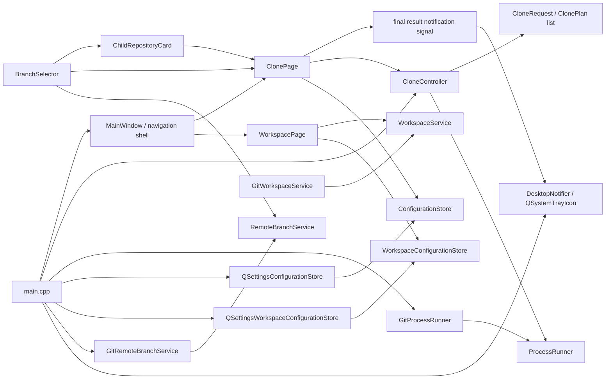
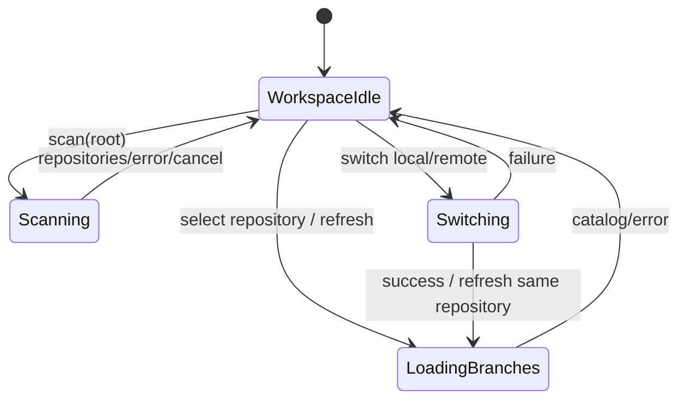
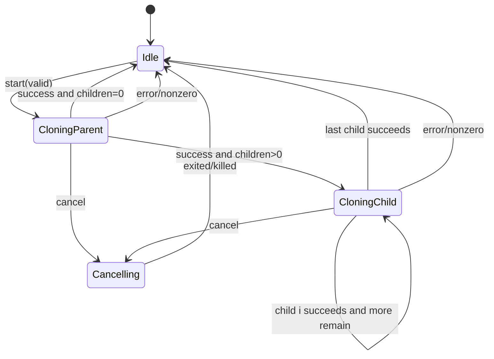
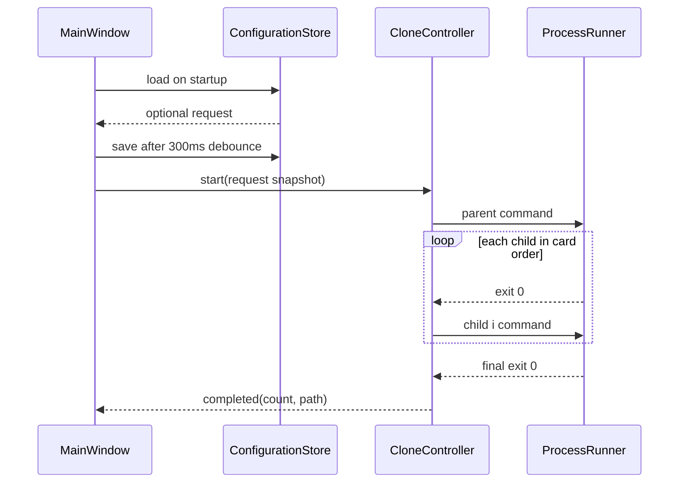
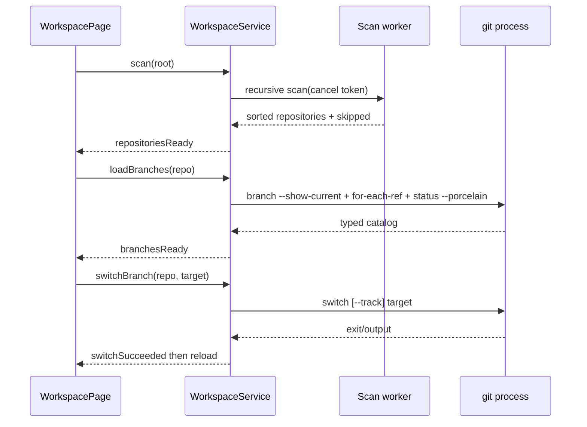

# 设计文档：git-clone-gui

> 阶段：design
>
> 工作流：requirements-first
>
> 设计深度：high
>
> 状态：已更新
>
> 最近更新：2026-08-14

## 设计摘要

- 目标：在保留既有克隆与交付能力的基础上，增加左侧导航和独立仓库工作区页面，递归发现嵌套 Git 工作树并安全查看/切换分支。
- 覆盖行为：REQ-001～REQ-013，当前增量聚焦 AC-013.13～AC-013.17。
- 核心方案：新增窄接口 `WorkspaceConfigurationStore` 与 QSettings adapter 保存工作目录；`GitWorkspaceService` 在 HEAD/refs 后异步读取 porcelain status 并返回分类计数；`WorkspacePage` 在当前分支下显示可测试的干净状态或高对比风险警示卡。
- 模块/构建边界：ARCH-001～ARCH-013 / BUILD-001～BUILD-011；不新增 target，只在既有 application/infrastructure/presentation target 内增加源码和符合现有方向的依赖。

## 代码库调查

| 证据类型 | 证据 | 已验证事实 | 对设计的影响 |
|---|---|---|---|
| 当前结构 | `inspect_structure.py` | 实施后 50 个源文件；MainWindow 173 行，ClonePage 370 行，WorkspacePage 主实现低于 400 行且 UI 构建继续分文件，RepositoryTree 272 行；五层 target 保持 | 导航壳、页面、配置 adapter、状态读取和视觉组件职责分离，均未改变 target 方向，资源/部署仍归 app target |
| 当前 core | `CloneRequest.h/.cpp` | 已使用 `QList<ChildRepositoryRequest/Plan>`；父/子 clone 均未传 `--progress` | 命令计划增加显式进度参数，保持结构化执行与顺序不变 |
| 当前 application | `CloneController.cpp` | 已用 currentChildIndex 串行推进 0～N 子队列，所有结果汇入 `finish()` | 在有效任务开始时启动单调计时，在统一 finish 路径追加一次总耗时 |
| 当前 presentation | snapshot、`MainWindow*.cpp` | 双栏卡片界面与集中 QSS 已完成 | 图标沿用其蓝色 “G” 视觉语言 |
| 当前 infrastructure | `GitProcessRunner`、`QSettingsConfigurationStore` | `QProcess::MergedChannels` + `readyRead` 已按到达异步转发；问题不在读取链路 | 本轮不修改 runner，避免无依据重构 |
| Git clone 进度 | Git 2.44.0 行为与 `git clone -h` | stderr 非终端时默认可能抑制传输进度，`--progress` 可强制输出 | 父/子计划统一显式传参，由现有 merged-channel readyRead 实时显示 |
| 工具链 | CMake cache/既有回归 | Qt 5.15.2、macOS arm64 可构建 | 使用 Qt 5.15/6 公共 API |
| 当前 Bundle | `du`、`plutil`、`find`、`otool` | Debug 约 524 KB；`CFBundleIconFile` 为空；无 Resources/Frameworks/PlugIns | 现状只是开发构建物，不是最终部署产物 |
| 部署工具 | `/Users/qingyizhu/Qt5.15.2/bin/macdeployqt -h` | 当前 kit 的官方工具可收集 Framework 与插件 | 安装阶段调用对应 kit 工具生成自包含 Bundle |
| 分支输入 | `MainWindowUi.cpp`、`ChildRepositoryCard.cpp` | 父/子分支均为普通 `QLineEdit`，URL 变化不触发远程查询 | 新增独立可编辑选择组件，父/子复用 |
| 远程查询 | `ProcessRunner`、`GitProcessRunner` | 克隆 runner 是单进程互斥状态机，不能承载并发分支查询 | 新建 service port/adapter，每次查询独立 QProcess，不改变克隆状态 |
| 目录校验 | `CloneRequest.cpp` | `QFileInfo::exists(parentTarget)` 一律拒绝，包括空目录 | 改为仅拒绝文件和非空目录 |
| 结果与布局 | `MainWindow.cpp`、`MainWindowUi.cpp` | 完成使用 `QMessageBox`；右栏顺序固定，preview 最高 170px 后日志获得余量 | 页内状态卡 + 纵向 splitter，日志默认至少 280px |
| 页面职责 | `inspect_structure.py`、`MainWindow*` | `MainWindow.cpp` 372 行、UI 构建 284 行，已同时承担壳与克隆页面 | 第二页接入前机械迁出 `ClonePage`，主窗口不承载页面字段或 Git I/O |
| 本地仓库能力 | Git 2.44.0 只读探测 | `.git` 可为文件/目录；`for-each-ref`、`symbolic-ref`、`switch` 可用 | 扫描识别两种 marker，引用用稳定 format 读取，切换用结构化参数 |

### 工具链与兼容性基线

| 项目 | 已验证值 | 证据 | 设计结论 |
|---|---|---|---|
| OS/架构 | macOS 15.7.5 arm64 | `sw_vers`、`uname -m` | required 产物仍为 arm64 `.app` |
| 构建 | CMake 3.27.1、Ninja 1.11.1、Clang 17 | 版本命令 | Preset/输出路径不变 |
| Qt | Qt 5.15.2 已验证；Qt 6 由既有 GitHub runner 验证 | CMake cache、既有 Actions run | 使用 Core/Widgets/Concurrent 公共 API |
| macOS 部署 | `macdeployqt` 来自当前 Qt 5.15.2 kit | 工具帮助与 qmake query | Release 安装树可原生部署并验证 self-contained |
| Git 分支广告 | Git 2.44.0、本地 `ls-remote --symref`、官方文档 | HEAD symref 和 heads 可读取；未 fetch 的对象不能按 `committerdate` 排序 | 默认与常用工作分支族优先，不做虚假的最近提交排序 |

## 约束与设计原则

- 保留 `program + QStringList arguments`，预览与执行分离。
- 子仓库列表是有序值对象；运行时复制快照，UI 后续变化不影响任务。
- presentation 只依赖 application/core 契约，不直接 include QProcess 或具体 QSettings 类。
- QSettings 只保存表单字段和 schemaVersion，不保存日志、任务状态或凭据对象。
- MainWindow 负责页面级布局/状态，单卡字段、标题、删除事件归 `ChildRepositoryCard`。
- 不引入 QML、第三方主题库、拖拽排序或破坏性目录清理。
- 图标保留 SVG 源文件并提交生成的 `.icns`；开发 Bundle 可保持轻量，安装树才执行 Qt runtime 部署。
- 分支查询不复用克隆 runner、不触发 shell、不持久化分支清单；请求 ID、超时和 URL 快照共同隔离过期结果。
- 结果反馈优先于克隆完成后自动发生的重新校验；用户再次编辑任一配置时才恢复校验视觉状态。
- clone 命令计划负责声明 `--progress`；runner 只转发字节，controller 只统计整个任务耗时，职责不跨层。
- 主窗口只组合导航和页面，不直接遍历文件系统或启动 Git；每个独立页面持有自己的视图状态。
- 工作区扫描不跟随符号链接、不进入 `.git`，发现仓库后不剪枝；远端候选只基于当前 remote-tracking refs，不隐式 fetch。

## 方案比较

| 方案 | 需求覆盖 | 优点 | 代价与风险 | 结论 |
|---|---|---|---|---|
| A：Qt Widgets 自定义卡片 + QSS + QSettings | 全覆盖 | 不增依赖、Qt 5/6 兼容、可复用既有逻辑 | QSS 需要视觉回归 | 采用 |
| B：迁移 QML | 全覆盖 | 动态列表和动画方便 | 重写表示层、部署增加 QtQuick，范围过大 | 否决 |
| C：MainWindow 内动态创建全部字段并直接 QSettings | 功能覆盖 | 初始文件少 | MainWindow 膨胀、依赖反转、难测试 | 否决 |
| D：每次 POST_BUILD 都运行 `macdeployqt` | REQ-008 | build tree 立即自包含 | 每次增量构建都复制/改写 Framework，慢且污染开发产物 | 否决 |
| E：安装阶段运行当前 kit 的 `macdeployqt` | REQ-008 | 区分开发与部署产物，符合 CMake install 语义 | 最终交付需多执行一次 install | 采用 |
| F：通用 `git ls-remote --symref` + 默认/常用排序 | REQ-009 | 支持 SSH/HTTPS/本地等 Git URL，不下载对象，不绑定托管平台 | 不能获知最近提交时间 | 采用 |
| G：GitHub/GitLab API | REQ-009 | 可取得平台特有活跃度元数据 | URL 识别、Token、分页和多平台兼容显著扩大范围 | 否决 |
| H：浅抓取所有分支后按提交时间排序 | REQ-009 | 可得到真实提交时间 | 大仓库/多分支网络与临时磁盘成本高，违背轻量查询 | 否决 |
| I：侧栏 + `QStackedWidget` + 独立页面 | REQ-012～013 | 保留页面状态、Qt 5/6 兼容、职责清晰 | 需机械迁移既有页面 | 采用 |
| J：在 MainWindow 中追加工作区面板 | REQ-012～013 | 初始文件较少 | 壳、两页 UI、文件与进程职责混合 | 否决 |
| K：扫描 worker + 串行异步 Git service | REQ-013 | UI 响应、可取消、进程上限明确 | 需 generation 与 busy 状态 | 采用 |
| L：工作区页面直接使用 QSettings | AC-013.13 | 文件少 | presentation 泄漏具体存储并难以临时配置测试 | 否决 |
| M：独立工作目录 store port/adapter | AC-013.13 | key 边界清楚、可注入 fake、不会改变 clone schema | 增加一个窄接口和适配器 | 采用 |
| N：仅用 `git diff --quiet` 判断改动 | AC-013.14～17 | 命令简单 | 无法覆盖未跟踪文件，也不能提供分类数量 | 否决 |
| O：异步解析 porcelain status | AC-013.14～17 | 覆盖 staged/unstaged/untracked/conflict 且保持只读 | 分支读取状态机增加一步 | 采用 |
| P：在 MainWindow 直接使用 QSettings 保存页面 | AC-012.5 | 文件较少 | presentation 泄漏具体存储并破坏现有注入测试 | 否决 |
| Q：独立 NavigationConfigurationStore port/adapter | AC-012.5 | 枚举边界稳定、可 fake、key 独立 | 增加窄接口和组合参数 | 采用 |
| R：并行扫描多个子树 | AC-013.18 | 高并发磁盘上可能更快 | HDD/网络盘可能更慢，取消/排序/资源占用复杂，证据不足 | 本轮否决 |
| S：单 worker 低开销迭代 | AC-013.18 | 保持顺序和取消模型，消除 canonical 与 QFileInfoList 开销 | 仍受磁盘目录数下限约束 | 采用 |

### DEC-001：以结构化 QProcess 参数执行 Git

- 上下文与需求：REQ-002、REQ-003、NFR-001。
- 决策：沿用 `ProcessRunner::start(ProcessCommand)` 和 `QProcess::start(program, arguments)`。
- 理由：多子仓库只增加命令数量，不改变安全边界。
- 代价：预览单独 quoting。
- 被否决方案：shell/system/单字符串执行。

### DEC-002：状态机使用父阶段加有序子队列

- 上下文与需求：REQ-002、REQ-003、NFR-002。
- 决策：状态仍为 Idle/CloningParent/CloningChild/Cancelling；controller 额外持有 `currentChildIndex`，每次成功推进一项，0 项直接完成。
- 理由：避免状态枚举随子仓库数量扩张，且易用 fake runner 测试。
- 代价：状态文本必须携带 i/N 上下文。
- 被否决方案：为每个子仓库创建 controller 或并行克隆。

### DEC-003：Qt 6 优先、Qt 5.15 回退

- 上下文与需求：REQ-004、NFR-004。
- 决策：保留 versionless CMake 查找和公共 API。
- 理由：现有 Qt 5.15.2 验证环境稳定。
- 代价：不用 Qt 6 专属 UI/部署 API。
- 被否决方案：硬编码单一 Qt 路径。

### DEC-004：失败保留磁盘内容

- 上下文与需求：REQ-003。
- 决策：队列任一项失败/取消都停止且不删除文件。
- 理由：避免数据丢失。
- 代价：用户需手工处理部分目录。
- 被否决方案：自动递归清理。

### DEC-005：核心请求与计划采用有序列表

- 上下文与需求：REQ-001、REQ-002、REQ-005。
- 决策：`CloneRequest.children` 为 `QList<ChildRepositoryRequest>`；`ClonePlan.children` 为 `QList<ChildClonePlan>`，每项拥有 request 对应命令与绝对目标。
- 理由：保持输入顺序、单次校验、预览和队列执行使用同一事实源。
- 代价：现有单 child API 与测试需迁移。
- 被否决方案：在 UI 循环多次调用单 child controller。

### DEC-006：通过 application 存储契约注入 QSettings

- 上下文与需求：REQ-007、NFR-005、NFR-006。
- 决策：application 定义 `ConfigurationStore`（load optional / save bool）；infrastructure 实现 `QSettingsConfigurationStore`；composition 注入 MainWindow。
- 理由：UI 可用 fake store 测试，QSettings 不跨层泄漏。
- 代价：增加一个契约和适配器。
- 被否决方案：MainWindow 直接构造 QSettings、JSON 文件路径硬编码。

### DEC-007：双栏卡片式 Widgets 视觉系统

- 上下文与需求：REQ-005、REQ-006。
- 决策：左栏是可滚动配置区（父卡、子卡列表、添加按钮、目标卡）；右栏是固定执行区（摘要、预览、状态、日志、操作按钮）。统一浅色背景、白卡、12px 圆角、蓝色主色和等宽输出。
- 理由：控制窗口高度并建立视觉层级；动态列表不会挤压日志。
- 代价：需要 QWidget snapshot/人工视觉验证。
- 被否决方案：继续使用 QGroupBox 单列堆叠。

### DEC-008：应用图标使用可编辑 SVG 源与 Bundle `.icns`

- 上下文与需求：REQ-008 / AC-008.1、AC-008.2。
- 决策：在 `src/app/resources` 保存蓝色圆角 “G + Git 分支” SVG 源，使用能保留 alpha 的 macOS `sips` 直接渲染 RGBA 基图并生成 `GitCloneGui.icns`；CMake 将 `.icns` 标记为 `Resources` 并设置 `MACOSX_BUNDLE_ICON_FILE`。
- 理由：视觉与应用内品牌一致，源资产可维护，Finder/Dock 使用 macOS 原生图标格式。
- 代价：生成的 `.icns` 是二进制派生产物，需要在源图更新时重新生成；生成后必须检查 RGBA 与四角透明度，不能使用会合成白底的 thumbnail 路径。
- 被否决方案：仅在运行时设置 `QApplication::setWindowIcon`（不能可靠提供 Finder Bundle 图标）、只提交单尺寸 PNG。

### DEC-009：在安装阶段生成自包含 Bundle

- 上下文与需求：REQ-008 / AC-008.3、AC-008.4，NFR-007。
- 决策：配置时从当前 Qt CMake target/qmake 所在 bin 目录定位 `macdeployqt`；`cmake --install` 复制 `.app` 后执行该工具，收集 Qt Framework、plugins 并改写 install names。
- 理由：使用与实际链接版本一致的 Qt 官方部署工具，同时保持开发构建快速、轻量。
- 代价：安装 Bundle 明显变大；未签名部署会留下 ad-hoc/未签名限制。
- 被否决方案：手工复制 Framework/插件、硬编码 `/Users/...` 路径、对每次 build 执行部署。

### DEC-010：以独立异步 service 查询远程分支

- 上下文与需求：REQ-009、NFR-001、NFR-008。
- 决策：application 定义 `RemoteBranchService` 和 `RemoteBranchCatalog`；infrastructure 的 `GitRemoteBranchService` 为每个请求创建独立 `QProcess`，以结构化参数执行 `git ls-remote --symref URL HEAD refs/heads/*`，15 秒超时并设置 `GIT_TERMINAL_PROMPT=0`。
- 理由：父/子 URL 可并发查询且不干扰单进程克隆 runner，仍沿用用户的 Git URL 与 credential helper 配置。
- 代价：新增请求生命周期、缓存和输出解析逻辑；认证失败只能非阻塞提示。
- 被否决方案：复用 `GitProcessRunner`、presentation 直接使用 QProcess、同步执行。

### DEC-011：可编辑组合框提供默认/常用优先与包含式搜索

- 上下文与需求：REQ-009 / AC-009.2、AC-009.3。
- 决策：新增 `BranchSelector : QComboBox`，启用 editable 与 `QCompleter::PopupCompletion + Qt::MatchContains`；结果顺序为 default、常用 exact、常用 namespace、其余稳定名称顺序。折叠 chrome 不调用平台原生 QComboBox paint，而由组件用 QPainter 绘制完整圆角背景/边框、浅分隔线和可翻转 chevron；popup 列表继续使用 Qt 原生模型与 QSS。
- 理由：一个控件同时覆盖点击选择、任意手输和输入即筛选；Qt 5.15/6 均支持所需 API。
- 代价：排序代表默认/常用优先而非最近提交，失败状态主要通过 tooltip/控件属性表达；自绘 chrome 需用 snapshot 防止不同 DPI 下的视觉回归。
- 被否决方案：只读下拉、独立搜索框、伪造提交时间排序。

### DEC-012：页内结果优先并以 splitter 分配执行区

- 上下文与需求：REQ-010、REQ-003、REQ-006。
- 决策：移除完成/失败 `QMessageBox`；状态卡通过 `statusState=success|error|normal` 显示结果。preview/status 与日志放入纵向 `QSplitter`，日志最小 280px 且为默认主要区域。
- 理由：结果、错误和日志保留在同一视觉上下文，用户可按需拖动检查完整输出。
- 代价：MainWindow 需区分“配置校验状态”和“最近任务结果状态”。
- 被否决方案：仅美化系统 QMessageBox、固定压缩预览高度而不允许用户调整。

### DEC-013：最终 Completed/Failed 通过独立桌面通知适配器提示

- 上下文与需求：REQ-010 / AC-010.5，NFR-009。
- 决策：MainWindow 只在最终 `jobFinished(Completed|Failed)` 发出 `taskResultNotificationRequested(title, message, severity)`；Completed 使用完成标题和 Information，Failed 使用失败标题和 Critical，Cancelled 不发。presentation 的 `DesktopNotifier` 使用 `QSystemTrayIcon::showMessage` 转交操作系统，并在不支持 tray/messages 时静默返回。app 组合根连接两者。
- 理由：完成触发语义仍由已有 controller/MainWindow 结果流决定，系统能力封装在独立 UI 适配器；测试可验证请求次数而不真的打扰通知中心。
- 代价：Qt 的系统通知受操作系统权限控制；为投递消息会短暂显示 tray/status item，随后自动隐藏。
- 被否决方案：恢复阻塞式 QMessageBox、用 shell/AppleScript 注入通知、在 CloneController 中直接依赖 Widgets。

### DEC-014：GitHub Actions 原生双平台构建，签名能力按 Secrets 门控

- 上下文与需求：REQ-011、NFR-010。
- 决策：单一 `release.yml` 编排独立的 `macos-15` arm64 与 `windows-2022` x64 job；共同执行 Release configure/build/CTest/install，各平台再使用 Qt 官方部署工具生成 DMG/ZIP。普通 push/PR/手动运行上传 Actions artifact，只有 `v*` 标签在两个 job 成功后通过 `gh release` 创建长期 Release。Apple Developer ID/公证和 Windows Authenticode 由独立脚本消费 GitHub Secrets；Secrets 不完整时明确降级为 unsigned artifact。
- 理由：目标平台原生 runner 能给出真实编译/链接/部署证据；部署与签名脚本可本地复用和单独审查，YAML 只负责编排；无证书时不阻塞开源项目的可下载测试包。
- 代价：可信发布依赖外部证书、Apple Developer Program 与公证服务；Windows 首期提供便携 ZIP 而非 MSI。
- 被否决方案：在 Mac 上交叉编译 Windows、上传裸 `.exe`/build-tree `.app`、把证书提交到仓库、每次普通 push 自动创建 Release。

### DEC-015：无 Developer ID 时也对部署 Bundle 执行完整 ad-hoc 重签与严格验证

- 上下文与需求：REQ-011 / AC-011.3、AC-011.4，NFR-007；FACT-021。
- 决策：`DeployMacOS.cmake` 在没有 `GIT_CLONE_GUI_MACOS_SIGNING_IDENTITY` 时向同 Qt kit 的 `macdeployqt` 传递 `-codesign=-`，由部署工具按嵌套代码顺序对 executable、Frameworks、PlugIns 和最终 `.app` 统一 ad-hoc 重签；`package-macos.sh` 无论是否存在 Developer ID 都先执行 `codesign --verify --deep --strict`，验证失败即停止上传。ad-hoc 仅保证 Bundle 未被部署过程破坏，不标记为 Developer ID 签名或公证。
- 理由：Apple Silicon 链接器给主程序生成的 ad-hoc 签名在部署资源与嵌套代码后不再代表完整 Bundle；使用 `macdeployqt` 已提供的 `-codesign` 能保持 Qt 5.15/6 共用部署路径，并把签名顺序留给平台部署工具。
- 代价：无证书 Release 仍会被 Gatekeeper 识别为未知开发者，首次运行需要用户在“系统设置 → 隐私与安全性”选择“仍要打开”；只有 Developer ID + 公证能实现可信无覆盖步骤分发。
- 被否决方案：跳过 `codesign` 检查继续上传、让用户执行 `xattr -dr` 清除系统隔离、只重签主 executable、把 Apple Development 证书冒充站外分发证书。

### DEC-016：显式启用 Git 进度并由 controller 统计任务总耗时

- 上下文与需求：REQ-003 / AC-003.1、AC-003.6、AC-003.7，NFR-003、NFR-011；FACT-023。
- 决策：`CloneRequest` 为父项目和所有子仓库命令统一生成 `git clone --progress --branch ... --single-branch ...`；`GitProcessRunner` 继续使用 merged channels 的 `readyRead` 即时转发。`CloneController` 在输入与 Git 可执行文件检查通过后、启动父阶段前启动 `QElapsedTimer`，在 Completed/Failed/Cancelled 共用 `finish()` 中计算毫秒差并追加一次 `总耗时：%1 秒`，固定一位小数。
- 理由：问题根因是 Git 的非终端输出策略，而不是 Qt 事件链；显式参数可跨 macOS/Windows 保持一致。单调计时不受系统时钟调整影响，统一 finish 路径天然覆盖三种最终结果并避免重复。
- 代价：Git 的进度通常使用 `\r` 更新，同一日志区域可能保留较密集的进度文本；这是保留原始到达顺序和诊断信息的可接受代价。
- 被否决方案：周期性轮询磁盘推算百分比（不准确且增加 I/O）、用伪终端欺骗 Git（跨平台复杂）、在 MainWindow 用墙上时间计时（结果语义泄漏到表示层）。

### DEC-017：主窗口采用固定侧栏与页面栈

- 上下文与需求：REQ-012、NFR-006；FACT-025。
- 决策：将现有克隆界面迁入 `ClonePage`，`MainWindow` 仅拥有左侧导航、`QStackedWidget`、页面生命周期和关闭协调。
- 理由：仓库克隆与仓库工作区是两个可独立变化的页面，页面栈能够保留切换前状态，并符合现有 Qt Widgets 技术栈。
- 代价：需要一次机械迁移并保持旧对象名、通知信号与测试语义。
- 被否决方案：继续在 `MainWindowUi.cpp` 追加树和分支面板；使用多个顶级窗口。

### DEC-018：仓库发现使用可取消 worker，Git 操作使用异步 QProcess

- 上下文与需求：REQ-013 / AC-013.1～AC-013.4、AC-013.8～AC-013.9，NFR-012、NFR-013。
- 决策：`GitWorkspaceService` 实现 application 的 `WorkspaceService` port；目录扫描由 `QtConcurrent::run` 执行并用 generation/cancel token 丢弃旧结果，分支读取与切换由单个异步 `QProcess` 串行执行。
- 理由：深目录遍历和 Git 命令都可能耗时，不能运行在 UI 线程；单 Git 进程避免同一 service 内切换与刷新竞态。
- 代价：构建新增 Qt Concurrent 组件；扫描结果通过不可变值对象跨线程传递，service 需要清晰的 busy/generation 状态。
- 被否决方案：UI 线程递归扫描；为每个仓库并行启动 Git。

### DEC-019：树层级来自工作目录相对路径

- 上下文与需求：REQ-013 / AC-013.1～AC-013.3。
- 决策：扫描 service 返回去重、规范化、按相对路径排序的 `RepositoryInfo`；`WorkspacePage` 为路径中的中间目录创建只读容器节点，仓库节点保存绝对路径角色数据。
- 理由：文件系统层级最符合父项目/子项目语义，同时不会把普通中间目录误当仓库。
- 代价：根目录本身为仓库时使用特殊的根仓库节点；符号链接目标不显示。
- 被否决方案：纯平铺列表；发现父仓库后停止递归。

### DEC-020：远端待跟踪分支按短名差集计算

- 上下文与需求：REQ-013 / AC-013.4～AC-013.7；ANA-019、ANA-020。
- 决策：读取 `refs/heads` 和 `refs/remotes`，排除 `*/HEAD`；远端完整名移除第一个 `/` 得到短分支名，短名存在于本地集合时不进入候选，否则保留完整 `<remote>/<branch>` 供切换。
- 理由：满足“远端只列出本地没有的”，并在多个 remote 同名时避免丢失来源信息。
- 代价：只读取当前 remote-tracking refs，不自动 fetch；远端实际新分支需用户先在应用外更新引用。
- 被否决方案：按完整 ref 比较；自动 fetch。

### DEC-021：仓库树使用专用控件与自绘 delegate

- 上下文与需求：REQ-013 / AC-013.10～AC-013.12，NFR-014；FACT-028。
- 决策：presentation 新增 `RepositoryTree : QTreeWidget`，内部安装 `QStyledItemDelegate`；delegate 负责整行圆角 hover/selected chrome、层级 guide、圆角 chevron、文件夹与 Git 仓库线性矢量图标和文本。关闭原生 branch decoration，节点通过 `RepositoryNodeKindRole` 标识 Root/Directory/Repository，显示文本保持纯名称。
- 理由：QSS 无法可靠让 macOS 原生 branch indicator 与 item 共享同一个圆角背景，自绘能够在 Qt 5.15/6 和不同平台稳定复现；小型 `QPainterPath` 图标无需二进制资产或系统主题依赖。
- 代价：需要维护绘制几何与颜色，并用 snapshot/像素测试保护；delegate 必须保留 selection、focus、disabled 和展开交互语义。
- 被否决方案：继续用 `◆`/emoji 文本前缀；使用 `QIcon::fromTheme`（平台结果不一致）；仅 QSS 设置 `QTreeView::branch` 图片（无法统一整行背景与高 DPI 绘制）。

### DEC-022：工作目录使用独立配置契约持久化

- 上下文与需求：REQ-013 / AC-013.13，NFR-015；FACT-029。
- 决策：application 新增 `WorkspaceConfigurationStore`，只读写 optional root path；infrastructure 的 `QSettingsWorkspaceConfigurationStore` 使用 `workspace/schemaVersion=1` 与 `workspace/rootPath`，支持系统用户域和临时 INI 两种构造；app 与 `WorkspacePage` 注入该契约。页面启动恢复输入，文本变化 300ms 后保存，关闭前补刷待保存值；有效恢复路径的自动扫描由后续 DEC-025 追加。
- 理由：工作区配置与 CloneRequest 生命周期/模式不同，窄接口能保持 schema、依赖方向和测试隔离，同时避免启动即遍历可能很大的目录。
- 代价：组合根多一个 store 实例；两者共享 organization/application 下的 QSettings 文件但 key namespace 独立。
- 被否决方案：扩展 `CloneRequest`、页面直接构造 QSettings；恢复后自动扫描在 FACT-030 的新用户要求下由 DEC-025 重新评估并采用。

### DEC-023：分支目录加载包含只读工作树状态

- 上下文与需求：REQ-013 / AC-013.14～AC-013.17，NFR-012、NFR-015；FACT-029。
- 决策：`BranchCatalog` 增加 `WorkingTreeStatus`（staged/unstaged/untracked/conflicts）；`GitWorkspaceService` 在读取当前分支和 refs 后以结构化参数异步执行 `git status --porcelain=v1 --untracked-files=normal`，解析每个 record 的 XY 状态。任一计数非零即 dirty；UI 始终显示状态，clean 使用低对比绿色条，dirty 使用琥珀色背景、左侧强调线、粗体标题和非零分类数量，并明确提示谨慎切换。
- 理由：porcelain v1 是面向脚本的稳定格式，能覆盖未跟踪文件并区分四类风险；复用既有单 QProcess 状态机保持串行与取消语义。
- 代价：每次刷新多一次只读 Git 命令；包含换行的极端路径不影响 dirty 判断，分类计数按 status record 计算。
- 被否决方案：同步 QProcess、只读 `git diff`、仅显示一个 dirty 布尔值、脏状态直接禁止切换。

### DEC-024：导航页通过独立配置契约恢复

- 上下文与需求：REQ-012 / AC-012.5，NFR-015；FACT-030。
- 决策：application 定义 `NavigationConfigurationStore` 与稳定枚举 `NavigationPage`；infrastructure 的 QSettings adapter 使用 `navigation/schemaVersion=1` 和 `navigation/currentPage`。`MainWindow::selectPage` 成功切页后保存，构造完成时读取并恢复；未知值和读取失败统一回退 Clone。
- 理由：页面身份不属于克隆或工作区根路径模型，独立窄接口维持 presentation → application ← infrastructure 方向并易于 fake 测试。
- 代价：组合根增加一个 store 实例；导航点击会同步一次极小 QSettings 写入。
- 被否决方案：MainWindow 直接 QSettings、把 page index 塞进 WorkspaceConfigurationStore、依赖按钮文本作为持久值。

### DEC-025：恢复有效工作目录后排队自动扫描一次

- 上下文与需求：REQ-013 / AC-013.13，NFR-016；FACT-030。
- 决策：`WorkspacePage` 先恢复输入、建立全部信号连接，再通过 `QTimer::singleShot(0)` 调用 `startScan()`；只对现有、可读目录安排一次。无效路径保留给用户修正并显示错误，不循环重试。自动扫描与手工扫描复用相同 generation/cancel 状态机。
- 理由：排队到事件循环可确保窗口先完成构造和显示，扫描仍在 worker，不阻塞 UI；复用入口避免两套状态语义。
- 代价：启动后立即产生一次后台目录 I/O；这是用户明确要求，且可取消。
- 被否决方案：构造函数内同步调用、仅恢复到工作区页面时才扫描、周期轮询目录。

### DEC-026：扫描器使用无 canonical 的唯一父路径迭代与平台快路径

- 上下文与需求：REQ-013 / AC-013.1～3、AC-013.18，NFR-013、NFR-016；FACT-031。
- 决策：入口根路径只做一次 absolute/clean，不再为每个目录调用 `canonicalFilePath()`。Unix/macOS 使用 `opendir/readdir` 的 `d_type` 在一次目录读取中识别子目录、`.git` 文件/目录和 symlink；仅 `DT_UNKNOWN` 回退 `lstat`。Windows/其他平台保留 `QDir::entryList` 兼容路径。由于不跟随目录 symlink，每个真实目录只能从唯一父目录到达，无需 canonical visited set；仓库结果仍按 relative path 稳定排序。
- 理由：首轮仅替换为 `QDir::entryList` 后，10,000 目录中位数降至 323ms，但真实 57,327 目录工作区中位数仅从 18.019s 降至 17.278s，表明 Qt 类型过滤仍有显著元数据成本；平台快路径复用目录项类型可继续减少系统调用，同时保留嵌套发现、取消、不可读计数与确定性。
- 代价：无法用 canonical set 防御底层文件系统制造的目录硬链接环；普通平台不允许目录硬链接，本轮继续禁止 symlink，风险可接受。
- 被否决方案：固定忽略 build/node_modules（会漏仓库）、多 worker 并行 I/O、调用外部 `find`/shell、所有平台强行使用 POSIX API（破坏 Windows 构建）。

### DEC-027：版本号以 CMake project 为单一来源，Release 说明按标签选择

- 上下文与需求：REQ-011 / AC-011.8～AC-011.9；FACT-032。
- 决策：根 `project(VERSION)` 设为 `0.1.4`，app target 通过私有编译定义把 `${PROJECT_VERSION}` 注入 `main.cpp`；macOS Bundle 继续直接使用同一变量，`MainWindow` 读取 `QCoreApplication::applicationVersion()` 展示版本。Release job checkout 标签源码，优先读取 `docs/releases/${GITHUB_REF_NAME}.md`，缺失时回退 `--generate-notes`。
- 理由：避免 CMake、运行时、Bundle 和 UI 四处手写版本漂移；版本说明进入代码评审且未来标签仍具备安全回退。
- 代价：每次正式发版必须同时更新 CMake 版本和对应说明文件。
- 被否决方案：只改标签、在 MainWindow 硬编码版本、让每次 Release 仅依赖 GitHub 自动摘要。

## 总体架构



### 组件与职责

| 组件 | 职责与边界 | 输入/输出 | 相关需求 |
|---|---|---|---|
| `CloneRequest/ClonePlan` | 父字段、0～N 子列表、校验、命令计划、重复路径检查 | 表单值 → 有序计划/错误 | REQ-001, REQ-002 |
| `CloneController` | 父+子队列、当前索引、取消/结果 | plan + runner events → status/result | REQ-002, REQ-003 |
| `ConfigurationStore` | 持久化契约 | optional request / save result | REQ-007 |
| `QSettingsConfigurationStore` | schemaVersion、数组序列化、sync/status | QSettings ↔ CloneRequest | REQ-007 |
| `ChildRepositoryCard` | 单个子仓库字段、序号、删除信号、配置读写 | child value ↔ signals | REQ-005, REQ-006 |
| `MainWindow` | 双栏页面、卡片集合、摘要、预览、保存定时器 | 用户事件 ↔ controller/store | REQ-001, REQ-005～REQ-007 |
| `GitProcessRunner` | 单进程 QProcess 适配 | command ↔ async signals | REQ-002, REQ-003 |
| `RemoteBranchService` | 分支查询 port、请求 ID 与结果目录 | URL → catalog/error | REQ-009 |
| `GitRemoteBranchService` | 独立 QProcess、refs 解析、排序、缓存、超时 | Git refs ↔ catalog | REQ-009 |
| `BranchSelector` | 可编辑下拉、URL debounce、包含式搜索、过期结果隔离、自绘圆角 chrome/chevron | URL/catalog ↔ branch text | REQ-009 |
| `DesktopNotifier` | 把最终成功/失败请求转为系统托盘消息并处理能力降级/自动隐藏 | title/message/severity → OS notification | REQ-010 |
| `ClonePage` | 保留既有双栏克隆页面、配置保存、日志与通知请求 | 用户事件 ↔ controller/store | REQ-001～REQ-010 |
| `MainWindow` | 左侧导航、页面栈和关闭协调 | 导航事件 ↔ current page | REQ-012 |
| `WorkspaceService` | 扫描/分支读取/切换的异步 application 契约和值对象 | path/branch request → typed result/error | REQ-013 |
| `GitWorkspaceService` | worker 目录扫描、异步 Git refs 读取与 switch | 文件系统/Git ↔ service signals | REQ-013 |
| `WorkspacePage` | 工作目录输入、仓库树、分支列表与操作状态 | 用户事件 ↔ WorkspaceService | REQ-012, REQ-013 |
| `RepositoryTree` | 仓库树行布局、交互命中、矢量图标、层级与选择视觉 | typed node roles ↔ paint/expand/select | REQ-013 / AC-013.10～12 |
| `WorkspaceConfigurationStore` | 工作区根目录持久化契约 | optional path / save result | REQ-013 / AC-013.13 |
| `QSettingsWorkspaceConfigurationStore` | workspace namespace、schema、sync/status | QSettings ↔ root path | REQ-013 / AC-013.13 |
| `WorkingTreeStatus` | 已暂存、未暂存、未跟踪、冲突数量及 dirty 派生 | porcelain records → typed counts | REQ-013 / AC-013.14～17 |
| `NavigationConfigurationStore` | 当前导航页持久化契约 | optional NavigationPage / save result | REQ-012 / AC-012.5 |
| `QSettingsNavigationConfigurationStore` | navigation namespace、schema、sync/status | QSettings ↔ page enum | REQ-012 / AC-012.5 |

## 模块与依赖边界

### ARCH-001：依赖向 core/application 契约收敛

- 决策：presentation → application/core；infrastructure → application/core；app 组合具体实现。
- 组合根：`src/app/main.cpp`。
- 禁止：presentation include QProcess/QSettings/具体 infrastructure；application include Widgets/具体适配器；core include Widgets/I/O。
- 验证：target link/include 扫描。

### ARCH-002：有序请求与路径不变量归 core

- 每个子请求分别校验 URL/分支/相对路径；错误带 1-based 卡片序号。
- 任一子目标必须严格位于父目录内；规范化目标不得重复。
- 0 个子项有效；计划顺序与输入顺序一致。
- 预览由同一 `ClonePlan` 生成。

### ARCH-003：单 runner 串行队列

- runner 同时最多一个进程；controller 只在 exit 0 后推进。
- currentChildIndex 仅在 CloningChild 有效；finish 时复位。
- 取消 timer 与旧实现一致。
- 父/子命令计划均显式包含 `--progress`；runner 继续通过 `readyRead` 原样转发 merged channels，不缓存到阶段结束。
- controller 的任务级单调计时覆盖父阶段和全部子阶段，只在有效任务实际准备启动后开始，并在唯一 `finish()` 路径消费一次。

### ARCH-004：表示层分为页面与单卡组件

- `ChildRepositoryCard` 只拥有单卡控件和序号，不访问 controller/store。
- MainWindow 拥有卡片集合、布局、预览、摘要、保存 debounce 和运行门控。
- 配置区内部滚动；右栏日志获得 stretch。

### ARCH-005：配置存储通过契约隔离

- `ConfigurationStore` 位于 application，仅以 `CloneRequest` 读写。
- QSettings key：`schemaVersion=1`、`parent/url|branch|directory`、`destinationRoot`、`children` array 的 url/branch/path。
- `load()` 仅在 schemaVersion 存在时返回值；因此首次启动和已保存 0 子项可区分。
- save 后 `sync()`，status 非 NoError 返回 false。

### ARCH-006：视觉样式集中管理

- QSS 由 presentation 内的 `AppStyle::applicationStyleSheet()` 单点提供；对象名/动态属性区分 card、primary、secondary、danger、muted。
- 不在业务槽函数散落颜色/字体设置。
- 默认/最小尺寸和 splitter stretch 是页面契约。

### ARCH-007：远程分支查询通过独立 port/adapter 隔离

- `RemoteBranchService` 位于 application，公开 request/cancel 与带请求 ID 的 success/failure 信号；不依赖 Widgets 或具体 QProcess。
- `GitRemoteBranchService` 位于 infrastructure，拥有并发查询进程、15 秒超时、会话缓存、refs 解析和排序；不得启动 clone/fetch 或修改仓库。
- `BranchSelector` 位于 presentation，只管理一个 URL/分支输入的 debounce、suggestion model 与过期结果；MainWindow/Card 不解析 Git 输出。
- 克隆 `ProcessRunner` 与分支 service 无调用或状态共享；app 仍是唯一组合根。

### ARCH-008：最终成功事件与系统通知能力分离

- MainWindow 只根据最终 `CloneController::Outcome::Completed|Failed` 各发一次相应通知请求，不创建 `QSystemTrayIcon`，Cancelled 不发请求。
- `DesktopNotifier` 位于 presentation，只依赖 QtWidgets，负责 capability check、匹配应用视觉的通知图标、`showMessage` 和延时隐藏；不访问 controller/store/request。
- `src/app/main.cpp` 是唯一连接通知请求与具体 notifier 的组合根；通知失败不得反向改变任务状态。

### ARCH-009：CI 编排、平台部署与凭据处理分离

- `.github/workflows/release.yml` 只声明触发条件、runner、最小权限、构建步骤和产物传递，不包含业务源码或证书内容。
- `src/app/CMakeLists.txt`/`cmake/Deploy*.cmake.in` 拥有 build-tree 到自包含安装树的规则；Windows 资源只归 app target，不进入 core/application/infrastructure/presentation。
- `scripts/release` 拥有临时证书导入、平台签名、公证、DMG/ZIP 校验；脚本只接受环境变量/参数，不把 Secret 输出到日志或写入仓库路径。
- release job 只消费已完成的两个 artifact 并写 GitHub contents；构建 job 保持 `contents: read`，PR/fork 无 Secrets 时走 unsigned 分支。
- Release 文案以 `docs/releases/<tag>.md` 作为可评审输入；workflow 只负责选择说明文件或自动说明，不在 YAML 内硬编码某个版本正文。

### ARCH-010：导航壳与独立页面分离

- `MainWindow` 只创建/切换 `ClonePage` 与 `WorkspacePage`，不拥有表单字段、树节点模型、保存 debounce 或 Git 操作。
- `ClonePage` 保持既有 controller/store/branch service 契约和控件对象名；关闭协调通过 `requestClose()`/完成信号交给壳处理。
- `WorkspacePage` 只依赖 `WorkspaceService`，不 include filesystem、QProcess 或具体 infrastructure；页面切换不销毁页面实例。
- presentation 的组合根仍是 `src/app/main.cpp` 注入所有具体服务。
- `RepositoryTree` 只消费 `QTreeWidgetItem` 的 presentation role，不访问 WorkspaceService 或仓库数据源；`WorkspacePage` 不包含图标绘制细节。

### ARCH-011：工作区外部 I/O 通过单一 port/adapter 隔离

- application 定义 `RepositoryInfo`、`BranchCatalog`、`BranchTarget` 与 `WorkspaceService` 信号/命令契约，不依赖 Widgets/文件系统/QProcess。
- infrastructure 的 `GitWorkspaceService` 独占扫描 worker、取消 token、Git 进程、输出解析和结构化 switch 参数；同一时刻最多一个扫描和一个 Git 操作，新的请求使旧结果失效。
- 扫描不得进入 `.git` 或跟随符号链接；分支操作不得执行 fetch/reset/stash/clean 或 shell。
- `tests/infrastructure` 拥有临时目录扫描和真实本地 Git 仓库测试；`tests/presentation` 只用 fake service 验证页面状态。

### ARCH-012：工作区配置与状态读取保持边界独立

- application 的 `WorkspaceConfigurationStore` 只保存一个根路径，不依赖 CloneRequest、Widgets 或 QSettings；infrastructure adapter 独占具体 key、schema、sync 和错误状态。
- `WorkspacePage` 只通过 store port 恢复/延迟保存输入；默认 fallback store 为会话内空实现，保持现有测试和兼容构造可用。
- `WorkingTreeStatus` 作为 `BranchCatalog` 的值字段跨层传递；只有 `GitWorkspaceService` 解析 porcelain，presentation 不解析 Git 文本。
- 工作树状态读取只允许 `status`，不得因 dirty 自动调用或暗示已调用 stash/reset/clean，也不得改变 switch 参数。

### ARCH-013：启动状态和扫描优化不跨层

- application 的导航 store 只公开 `NavigationPage`，不依赖 Widgets/QSettings；MainWindow 不保存原始 stacked index 或按钮文本。
- `WorkspacePage` 只决定恢复后是否请求扫描，目录遍历实现仍完全位于 `GitWorkspaceService` worker；自动扫描不得把文件系统 I/O 移回 UI 线程。
- `GitWorkspaceService` 优化只能替换遍历内部算法，scan/取消/signals 与 `RepositoryInfo` 契约保持不变；不得为性能默认忽略任意普通目录。
- store adapters 可共享 organization/application 的物理 QSettings，但必须使用互不覆盖的 clone/workspace/navigation namespace。

## 构建与交付结构

### BUILD-001：现有 target 分层保持不变

- `git_clone_core`：列表模型/校验，QtCore。
- `git_clone_application`：controller + store contract，core/QtCore。
- `git_clone_infrastructure`：Git runner + QSettings store，application/QtCore。
- `git_clone_presentation`：MainWindow + card，application/core/QtWidgets。
- `GitCloneGui`：唯一组合根。

### BUILD-002：Qt 版本选择不泄漏业务代码

- 继续使用 `${QT_PACKAGE}::Core/Widgets/Test` 与 AUTOMOC；不添加 QtQuick。

### BUILD-003：Preset 与平台开发产物契约

- 本地 Debug/Release、macOS `build/<preset>/bin/GitCloneGui.app` 与 Windows `build/<preset>/bin/GitCloneGui.exe` 输出规则保持；CI 使用独立 `build/ci-*` 目录，避免污染本地 preset。

### BUILD-004：测试所有权扩展

- `test_clone_core`：0～N 计划、重复/逃逸路径、父/子 clone 的 `--progress` 参数。
- `test_clone_controller`：多项队列、0 项、失败门控、取消、输出即时转发以及 Completed/Failed/Cancelled 最终耗时一次性记录。
- `test_configuration_store`：临时 INI 路径往返、0 项、特殊字符。
- `test_presentation`：卡片增删/重编号、配置恢复、摘要、默认尺寸，并可输出 snapshot。
- `test_git_clone_workflow`：真实父 + 至少 2 个子仓库。

### BUILD-005：macOS 资源与部署职责归 app target

- `src/app/CMakeLists.txt` 只声明 app 资源、Bundle 元数据、安装规则以及当前 Qt kit 部署工具定位；业务 target 不感知打包。
- `.icns` 以 `MACOSX_PACKAGE_LOCATION=Resources` 随 Debug/Release Bundle 生成，`Info.plist` 的 `CFBundleIconFile` 与文件名一致。
- `.icns` 的 1024/512/256/128/32/16 各尺寸来自保留 alpha 的 RGBA 基图；四角 alpha 必须为 0。
- `cmake --install build/release --prefix build/install` 先复制 Bundle，再由生成的 install script 调用 `macdeployqt -always-overwrite`。
- 部署工具缺失时 Apple 配置必须给出明确 fatal 诊断，禁止静默产出伪自包含安装树。
- 非 Apple 平台不执行此部署脚本，现有 `WIN32`/普通 executable 入口保持不变。

### BUILD-006：分支查询与交互测试所有权

- `git_clone_application` 新增 branch service 契约；仍只依赖 core/QtCore。
- `git_clone_infrastructure` 新增 Git branch adapter；继续只依赖 application/QtCore，不新增 target 边。
- `git_clone_presentation` 新增 `BranchSelector`；继续依赖 application/core/QtWidgets。
- `test_git_remote_branches` 使用本地临时 Git 仓库验证解析、默认/常用排序、并发与错误；`test_presentation` 验证可编辑、包含匹配、过期结果和 splitter/页内状态。

### BUILD-007：桌面通知保持在 presentation/app 边界

- `git_clone_presentation` 新增 `DesktopNotifier`，沿用既有 QtWidgets 依赖；MainWindow 新增携带 title、message 与 `NotificationSeverity` 的通知信号。
- `GitCloneGui` 组合根只实例化 notifier 并连接信号，不引入平台 shell、额外 framework 或新 target 边。
- `test_presentation` 验证 Completed/Failed 各恰好一次对应通知且 Cancelled 零次；系统权限/通知中心展示作为 macOS 人工补充，不在测试中实际弹通知。

### BUILD-008：GitHub 双平台部署、签名与发布

- Windows：Visual Studio 2022 x64/MSVC 编译显式使用 UTF-8；app target 包含 `.ico`/`.rc`；install tree 为 `build/ci-windows/install/bin`，install script 调用同 Qt kit 的 `windeployqt` 收集 Qt DLL、`platforms/qwindows.dll` 和 compiler runtime；可选脚本用 PFX + `signtool` 签名主 `.exe`，最终 ZIP 根目录为 `GitCloneGui/`。
- macOS：`macos-15` arm64 runner 安装 Qt 6.8 LTS；install script 使用同 Qt kit 的 `macdeployqt`，存在 `GIT_CLONE_GUI_MACOS_SIGNING_IDENTITY` 时启用 notarization signing/hardened runtime/timestamp，否则使用 `-codesign=-` 完整 ad-hoc 重签；打包前无条件严格验证 Bundle，最终以 staging app + `/Applications` 链接生成 DMG。
- 公证：仅在 Developer ID 签名与 `APPLE_ID`、`APPLE_APP_PASSWORD`、`APPLE_TEAM_ID` 齐全时提交最终 DMG，等待 accepted 后 staple 并用 `spctl`/`stapler validate` 验证。
- GitHub：第三方 Actions 固定 commit SHA；两个 build job 分别上传单文件 artifact，tag-only release job checkout 标签、下载并校验恰有 DMG/ZIP 后通过 `gh release create/upload` 发布；存在同名 `docs/releases/<tag>.md` 时作为正文，否则使用自动生成说明。
- 版本：根 `PROJECT_VERSION` 通过 app 私有编译定义进入运行时，同时继续驱动 macOS Bundle 元数据；presentation 只读取 applicationVersion，不拥有独立版本常量。

### BUILD-009：工作区能力沿用既有 target

- `git_clone_application` 新增 `WorkspaceService` 值对象与 port，只依赖 QtCore/core；不新增 target。
- `git_clone_infrastructure` 新增 `GitWorkspaceService` 并私有链接 `${QT_PACKAGE}::Concurrent`；顶层 `find_package` 增加 Core/Widgets/Concurrent，不引入第三方库。
- `git_clone_presentation` 新增 `ClonePage`、`WorkspacePage` 与精简后的 `MainWindow`，仍只依赖 application/core/QtWidgets。
- `test_git_workspace` 归 infrastructure，`test_presentation` 增加导航/页面测试；Qt 5.15 与 Qt 6 使用共同 API。

### BUILD-010：工作区配置与状态测试仍归既有构建单元

- `git_clone_application` 增加 store port 与 status 值对象；`git_clone_infrastructure` 增加 QSettings adapter 并扩展 GitWorkspaceService；`git_clone_presentation` 只增加状态卡和 debounce 接线。
- `test_workspace_configuration_store` 使用临时 INI 验证首次、往返、空路径和覆盖；`test_git_workspace` 增加 clean/staged/unstaged/untracked/conflict；`test_workspace_presentation` 增加恢复、延迟保存和 clean/dirty 视觉语义。
- 不新增 Qt component、第三方依赖或跨 target 方向；Debug/Release、安装 Bundle 与既有 CI 产物契约不变。

### BUILD-011：导航持久化和扫描优化沿用既有 target

- `git_clone_application` 增加 navigation store 契约；`git_clone_infrastructure` 增加 QSettings adapter 并仅修改现有 GitWorkspaceService；`git_clone_presentation` 在 MainWindow/WorkspacePage 接线。
- `test_navigation_configuration_store` 用临时 INI 验证枚举往返/未知回退；presentation fake store 验证恢复页与一次自动扫描；`test_git_workspace` 的 10,000 目录用 `QElapsedTimer` 测量纯 scan 请求到完成，中位数门槛 1.5 秒。
- 无新增 Qt component/第三方包/target 边；macOS/Windows app、安装路径和运行时闭包不变。

## 平台与交付矩阵

| 目标平台/架构 | 开发构建物 | 安装产物 | 发布包 | 运行时依赖 | 原生验证 |
|---|---|---|---|---|---|
| macOS / arm64 | `build/debug/bin/GitCloneGui.app`，带 `.icns`、仍可依赖开发 Qt | `build/install/GitCloneGui.app`，自包含 Qt Framework/plugins | 不适用 | 安装产物内置 Qt 5.15.2 framework/plugin；运行仍需系统 Git | Debug/Release、CTest、self-contained delivery、`otool`、launch、Finder 图标检查 |
| GitHub macOS / arm64 | `build/ci-macos/bin/GitCloneGui.app` | `build/ci-macos/install/GitCloneGui.app`，Qt 6.8 自包含；无 Secrets 时完整 ad-hoc 签名，有 Secrets 时 Developer ID 签名 | `GitCloneGui-macOS-arm64.dmg`；`v*` 附加到 Release | Bundle 内置 Qt Framework/Cocoa plugin；运行仍需系统 Git | run `31512200305`：configure/build/CTest 6/6/install/ad-hoc 重签/严格 `codesign`/DMG/artifact/Release 成功；本机 DMG 挂载、quarantine 等价检查与启动成功；Developer ID/notary 待 Secrets |
| GitHub Windows / x64 | `build/ci-windows/bin/GitCloneGui.exe` | `build/ci-windows/install/bin/`，Qt 6.8 DLL/plugins/MSVC runtime、按 Secrets 可选 Authenticode | `GitCloneGui-Windows-x64.zip`；`v*` 附加到 Release | ZIP 内置 Qt/MSVC 运行时；运行仍需 Git for Windows | run `31506923442`：configure/build/CTest 6/6/windeployqt/runtime/ZIP/artifact 成功；Authenticode 待 Secrets |

### macOS 应用束约束

- Bundle ID、版本、可执行文件和输出路径沿用现有契约。
- `Contents/Resources/GitCloneGui.icns` 必须存在，`CFBundleIconFile=GitCloneGui.icns`。
- 安装树必须包含 `Contents/Frameworks/QtCore.framework`、`QtGui.framework`、`QtWidgets.framework` 和 `Contents/PlugIns/platforms/libqcocoa.dylib`。
- QSettings 使用 macOS 用户域，由 organization/application 名决定；不写入 bundle。
- 开发构建物与安装/部署产物分离；GitHub job 基于安装树创建 DMG。没有 Secrets 时 `.app` 必须通过完整 ad-hoc 签名结构验证，但 DMG 不具有 Developer ID 信任链；Secrets 完整时必须通过 Developer ID、公证和 stapling 验证。

### Windows 便携包约束

- `GitCloneGui.exe` 使用 `WIN32` subsystem，并通过 `.rc` 嵌入与 macOS 一致的 Windows `.ico`。
- `cmake --install` 的 `bin/` 是部署根；必须含 `Qt6Core.dll`、`Qt6Gui.dll`、`Qt6Widgets.dll`、`platforms/qwindows.dll` 及 `windeployqt` 判定的 compiler runtime。
- ZIP 内保留单一 `GitCloneGui/` 根目录；不生成 MSI，不把 Qt 开发目录或证书临时文件打入 ZIP。
- 仅主程序由项目证书 Authenticode 签名；Qt/运行库保留上游签名。签名路径必须 timestamp 并用 `signtool verify /pa` 验证。

## 复杂度预算与演进规则

| 维度 | 当前基线 | 边界/触发条件 | 触发后动作 | 验证 |
|---|---|---|---|---|
| MainWindow | 增量前 372 行并拥有完整克隆页 | 壳包含任一页面字段、用例或 I/O，或实现超过约 220 行 | 页面职责留在 `ClonePage`/`WorkspacePage`，壳只导航和关闭 | inspect_structure + 职责审查 |
| ClonePage | 从既有 MainWindow 机械迁移 | 新增工作区/导航职责，或单实现文件超过约 420 行 | 保持既有 Ui 分文件并提取独立 widget | inspect_structure + 旧测试回归 |
| WorkspacePage | 新页面 | 解析 Git 输出、遍历目录、或单实现文件超过约 420 行 | I/O 留在 adapter；视图子区域再拆 widget/model | include/API 审查 |
| RepositoryTree | 新视觉组件 | 访问 WorkspaceService、构建仓库层级或超过约 320 行 | 数据构建留在 WorkspacePage；图形 helper 保持组件私有 | include/API + paint 测试 |
| GitWorkspaceService | 新适配器 | 同时拥有 UI、持久化，或单文件超过约 420 行 | 扫描 helper 与 Git parser 可拆为 infrastructure 私有实现 | include/API/结构审查 |
| BranchSelector | 新组件 | 解析 Git 输出、管理多 URL 或访问 CloneController | 分别留在 infrastructure/MainWindow | include/API 审查 |
| Child card | 新组件 | 访问 controller/store 或负责列表 | 上移 MainWindow | include/API 审查 |
| Controller | 190 行 | 队列策略与 runner I/O 混合或出现并行 | 提取 queue policy | 状态机测试 |
| Store | 新适配器 | QSettings 泄漏到 presentation/application | 保持 port/adapter | include 扫描 |
| 顶层 CMake | 35 行 | 出现模块源码/样式/设置细节 | 下沉模块 CMake | 清单审查 |
| app CMake | 29 行 | 部署脚本逻辑超过约 80 行或混入其他平台细节 | 提取 `cmake/DeployMacOS.cmake.in` | 清单审查 + install 回归 |
| Release workflow | 新增 | 单个 YAML step 混合证书导入、签名、公证与打包细节 | 下沉 `scripts/release` 平台脚本 | actionlint/YAML 解析 + 原生 run |
| Release scripts | 新增 | 单脚本同时处理 macOS 与 Windows 或打印 Secret | 按平台/职责拆分并只经环境变量传值 | shell/PowerShell 静态审查 |

## 接口契约

| 接口 | 输入 | 输出/副作用 | 错误语义 | 兼容性 |
|---|---|---|---|---|
| `buildClonePlan(request)` | parent + ordered children | parentCommand + ordered children plans | 聚合编号错误，不写文件 | QtCore 5.15/6 |
| `CloneController::start` | 请求快照 | 顺序 runner.start | busy/invalid/git missing 拒绝 | QtCore 5.15/6 |
| `ConfigurationStore::load` | 无 | `optional<CloneRequest>` | 无配置/不可读返回 nullopt | C++17 |
| `ConfigurationStore::save` | CloneRequest | bool | sync 错误 false | C++17 |
| `ChildRepositoryCard` | child value/index | value、configurationChanged、removeRequested | 不自行校验全局路径 | QtWidgets 5.15/6 |
| `RemoteBranchService::requestBranches` | 仓库 URL | request ID；异步 catalog/error | 15 秒超时、取消/过期可忽略 | QtCore 5.15/6 |
| `BranchSelector` | URL + 可选初始分支 | branch text、下拉 suggestions | 查询失败仍可手输 | QtWidgets 5.15/6 |
| `WorkspaceService::scan` | 现有工作目录 | 异步 repository list + skipped count | invalid/unreadable error；新 scan 使旧结果失效 | QtCore 5.15/6 |
| `WorkspaceService::loadBranches` | repository absolute path | 异步 current/local/remote/candidates | repo missing/Git error，保留页面旧 catalog | QtCore 5.15/6 |
| `WorkspaceService::switchBranch` | repository path + local/remote target | 异步 success/error；成功改变 HEAD | 结构化 `git switch`，失败不做补救性修改 | QtCore 5.15/6 |
| `WorkspaceConfigurationStore::loadRootPath` | 无 | optional root path | 无配置/不可读返回 nullopt | C++17 |
| `WorkspaceConfigurationStore::saveRootPath` | trimmed path | bool | sync 错误 false；不修改页面输入 | C++17 |

## 数据模型与状态

```text
CloneRequest
  parentRepositoryUrl
  parentBranch
  parentDirectoryName
  destinationRoot
  children[]
    repositoryUrl
    branch
    relativePath

ClonePlan
  parentCommand
  parentTargetPath
  children[]
    command
    targetPath

RepositoryInfo
  absolutePath
  relativePath

BranchCatalog
  currentBranch       # empty means detached HEAD
  localBranches[]
  remoteBranches[]    # full remote/name, excluding */HEAD
  remoteCandidates[]  # remote short-name absent locally
  workingTreeStatus
    stagedChanges
    unstagedChanges
    untrackedFiles
    conflicts
```





## 关键流程



```mermaid
sequenceDiagram
    participant U as URL Edit
    participant B as BranchSelector
    participant S as RemoteBranchService
    participant G as git ls-remote
    U->>B: textChanged(url)
    B->>B: debounce 450ms / cancel stale
    B->>S: requestBranches(url)
    S->>G: --symref URL HEAD refs/heads/*
    G-->>S: HEAD + heads
    S-->>B: catalog(requestId)
    B->>B: apply only current request; preserve typed text
```



## 算法与伪代码

```text
onFinished(success):
  if cancelling -> Cancelled
  if failure -> Failed(current stage)
  if parent:
    if children empty -> Completed(0)
    else currentChildIndex=0; startChild(0)
  else if currentChildIndex + 1 < childCount:
    ++currentChildIndex; startChild(index)
  else -> Completed(childCount)

save debounce:
  on any field/card change -> timer.start(300)
  timeout -> store.save(currentRequest)
  close -> if timer active, stop and save immediately

scan(root):
  validate root; increment generation; cancel previous token
  worker DFS without symlink traversal
  for each directory: if child marker .git is file or dir -> add canonical path
  never enqueue .git; still enqueue other children of discovered repo
  sort relative paths; publish only if generation is current

remoteCandidates(local, remote):
  localSet = exact local names
  for each full remote ref except */HEAD:
    short = text after first '/'
    include full remote ref iff short not in localSet

parseWorkingTreeStatus(lines):
  for each non-empty porcelain v1 record:
    if XY == "??": untracked += 1
    else if XY is an unmerged pair: conflicts += 1
    else:
      if X != ' ': staged += 1
      if Y != ' ': unstaged += 1
  dirty iff any count > 0
```

## 错误处理与恢复

| 失败点 | 检测 | 处理 | 用户可见结果 | 恢复 |
|---|---|---|---|---|
| 卡片输入/重复路径 | core 校验 | 不启动 | 最多 3 行摘要 + 剩余数 | 修改对应卡片 |
| 任一 Git 阶段 | runner events | 停止队列 | 父或子 i/N + 错误 | 保留文件 |
| 设置不可写 | save=false | 不阻塞 | 状态区提示 | 当前会话继续、后续重试 |
| 旧/无 schema | load nullopt | 首次默认 1 张空卡 | 无错误 | 用户填写 |
| 远程分支查询失败/超时 | QProcess exit/error/timer | 释放请求、发非阻塞 error | selector tooltip/error property | 保持手工输入、URL 变化可重试 |
| 目标目录为文件或非空目录 | core 校验 | 不启动 | “父项目目标目录必须为空” | 更改目录名或清空目录（用户自行处理） |
| Windows/macOS 编译或 CTest 失败 | Actions job exit code | 停止该平台 job，不上传伪成品 | GitHub Checks 失败及日志 | 修复后重新运行 |
| Qt 部署工具缺失/失败 | install script fatal | 停止打包 | GitHub step 明确失败 | 检查 Qt kit/action 版本 |
| 签名 Secrets 缺失或不完整 | 平台脚本条件检查 | 跳过真实签名/公证，标记 unsigned | Job Summary | 配齐 Secrets 后重跑 |
| 签名或公证验证失败 | `codesign`/`notarytool`/`signtool` 非零 | 停止发布，不上传冒充正式签名的包 | GitHub job 失败 | 更新证书/密码/协议后重跑 |
| 工作目录无效/不可读 | service preflight/worker | 不替换旧结果 | 路径与具体错误 | 重新选择并扫描 |
| 子目录不可读 | worker error count | 跳过该子树并继续 | 完成提示含跳过数量 | 修正权限后重新扫描 |
| 仓库被删除/refs 读取失败 | Git 非零/启动失败 | 保留树与旧 catalog，禁用切换 | 仓库路径 + Git 输出 | 重新扫描/刷新 |
| switch 工作区冲突 | Git 非零 | 不执行 stash/reset/clean | 原始 Git 错误，当前分支不伪更新 | 用户手工处理后重试 |
| 工作目录配置不可写 | QSettings sync status | 保留当前输入并继续页面操作 | 非阻塞状态提示 | 后续编辑或下次启动重试 |
| status 读取失败 | Git 非零/启动失败/超时 | 整次 catalog load 失败，不伪造 clean | 仓库路径 + Git 输出 | 修复权限/仓库后刷新 |

## 非功能设计

- 安全/隐私：不使用 shell；QSettings 只含表单；不保存日志/任务状态；UI/README 提醒 URL Token 风险。
- 响应性：Git 异步；设置保存 debounce；左栏 scroll；日志 10,000 block。
- 可观测性：状态显示子项 i/N；预览展示所有命令；错误摘要压缩。
- 视觉：#F5F7FB 背景、#FFFFFF 卡片、#2563EB 主色、#DC2626 危险色、12px 圆角、清晰焦点环；字体使用系统默认，命令/日志用等宽字体。
- 兼容性：不依赖 macOS 私有 API；QSettings 使用 NativeFormat，测试使用 IniFormat 临时文件。
- 远程查询：450ms debounce、15 秒超时、`GIT_TERMINAL_PROMPT=0`、每 URL 会话缓存；只传结构化参数，不记录 URL/refs 到日志。
- 结果/日志：任务结束后的状态卡优先保持到下一次配置编辑；纵向 splitter 默认分配日志不少于 280px，用户可拖动。
- 发布安全：工作流顶层只读权限，tag release job 单独 `contents: write`；Actions 固定 SHA；证书从 Secrets 写入 runner 临时目录/临时 keychain，job 生命周期结束即销毁。
- 交付兼容：GitHub 标准 runner 只承诺 macOS arm64 与 Windows x64；macOS Intel/universal、Windows ARM64、MSI/PKG 不在本轮契约。
- 工作区响应性：目录递归在 QtConcurrent worker；Git refs/switch 在异步 QProcess；所有完成信号以 generation/当前仓库路径校验后更新页面。
- 工作区容量：扫描数据仅保存仓库路径和跳过计数；不读取仓库文件内容，不跨符号链接，不缓存 Git 输出历史。
- 工作区配置：输入变化 300ms debounce；只保存 trimmed 根目录，不保存仓库清单、当前分支或工作树状态；有效恢复路径按 DEC-025 自动扫描一次。
- 工作树风险：clean/dirty 状态随每次 branch catalog 读取实时返回；dirty 警示使用语义属性统一样式并保持切换按钮由原选择/busy 逻辑控制。

## 正确性属性

### PROP-001：所有子目标均位于父目录内且唯一

- 来源：REQ-001 / AC-001.3。
- 属性：任意通过校验的计划中，每个 childTarget 严格位于 parentTarget 下，且 childTarget 集合无重复。
- 验证：表驱动 core 测试。

### PROP-002：失败不会越过队列边界

- 来源：REQ-002 / AC-002.2、AC-002.3。
- 属性：父或子 i 失败时，runner 历史不包含任何后续子项。
- 验证：fake runner 状态机测试。

### PROP-003：执行参数不经过 shell

- 来源：REQ-002 / AC-002.1、NFR-001。
- 属性：每个输入字段在其命令中保持一个参数元素。
- 验证：core 测试与静态检查。

### PROP-004：任务互斥并最终恢复 Idle

- 来源：REQ-002 / AC-002.5、REQ-003 / AC-003.4。
- 属性：非 Idle 拒绝 start；完成/失败/取消最终回 Idle。
- 验证：状态机序列测试。

### PROP-005：配置保存恢复往返保持顺序和值

- 来源：REQ-007 / AC-007.1、AC-007.2。
- 属性：对任意可序列化 CloneRequest，`save(x); load()` 保持所有字段、子项数量与顺序相等，包括 0 子项。
- 验证：临时 INI QSettings 往返测试。

### PROP-006：卡片列表与请求列表一一对应

- 来源：REQ-005 / AC-005.1、AC-005.2。
- 属性：任意增删序列后，请求 children 数量/顺序等于当前可见卡片，标题连续为 1..N。
- 验证：presentation 测试。

### PROP-007：安装 Bundle 的 Qt 依赖闭包位于应用内部

- 来源：REQ-008 / AC-008.3、AC-008.4，NFR-007。
- 属性：部署后的主 executable 与 Qt 插件不包含指向 Qt 开发目录的绝对动态依赖；所需 Qt Framework 与 Cocoa platform plugin 均位于 Bundle 内。
- 验证：`verify_delivery.py --require-self-contained`、递归 `otool -L`、bundle 结构与启动检查。

### PROP-008：应用图标圆角外保持透明

- 来源：REQ-008 / AC-008.5。
- 属性：从源 SVG 生成的 1024 PNG 以及从 Bundle `.icns` 反解出的最大尺寸图像均为 RGBA，四个角像素 alpha 等于 0；不得出现不透明白色画布。
- 验证：`sips -g hasAlpha` 与图像像素 alpha 断言、Dock/Finder 人工检查。

### PROP-009：分支建议始终属于当前 URL 请求

- 来源：REQ-009 / AC-009.1、AC-009.4、AC-009.5。
- 属性：对于任意交错完成的 URL 查询序列，BranchSelector 只应用其最后一个 URL 对应的当前 request ID；失败或过期结果不改变用户已输入分支文本。
- 验证：fake service 乱序完成测试与本地 Git 并发查询测试。

### PROP-010：目标目录校验与 Git 空目录能力一致

- 来源：REQ-010 / AC-010.1。
- 属性：父目标不存在或为空目录时计划有效；同一路径为文件或包含任意可见/隐藏条目的目录时计划无效且错误包含“必须为空”。
- 验证：临时目录表驱动 core 测试。

### PROP-011：任务结果不会被同一完成事件的重新校验覆盖

- 来源：REQ-010 / AC-010.2、AC-010.3。
- 属性：Completed/Failed 到达后状态卡分别保持 success/error 与任务消息，直到用户修改配置或启动新任务；日志内容不清空。
- 验证：presentation 信号驱动测试与 snapshot 人工检查。

### PROP-012：分支选择器不暴露平台原生直角边框

- 来源：REQ-006 / AC-006.3，REQ-009 / AC-009.6。
- 属性：任意正常、悬停、聚焦、禁用与 popup 展开状态下，BranchSelector 的折叠外框由同一 8px 圆角路径绘制；右侧只有浅分隔线和 chevron，不出现独立黑色矩形边框，popup 可见时 chevron 翻转。
- 验证：selector paint/state 测试与默认窗口 snapshot 人工检查。

### PROP-013：结果通知与最终成功/失败一一对应

- 来源：REQ-010 / AC-010.5，NFR-009。
- 属性：任意克隆状态序列中，每个最终 Completed 恰好产生一个 Information 完成通知请求，每个最终 Failed 恰好产生一个 Critical 失败通知请求；Cancelled、父阶段成功和中间子阶段成功产生零个通知。notifier capability 失败不改变结果或页内状态。
- 验证：presentation 的可控 runner 完成/失败/取消信号计数和标题/级别测试，以及 notifier capability 代码审查。

### PROP-014：每个平台发布包具有完整运行时闭包和有效 Bundle 结构

- 来源：REQ-011 / AC-011.2、AC-011.3。
- 属性：成功上传的 Windows ZIP 解压后包含 exe、Qt Core/Gui/Widgets DLL、qwindows plugin 和 compiler runtime；macOS DMG 内 app 包含 Qt Frameworks、Cocoa plugin 与图标，二者均不引用 runner Qt 安装绝对路径；macOS 完整 Bundle 在部署后必须通过严格代码签名结构验证。
- 验证：原生 runner 上的结构断言、`windeployqt`/`macdeployqt` 退出码、Windows 文件清单、macOS delivery/`otool` 与 `codesign --verify --deep --strict` 检查。

### PROP-015：签名声明与实际验证状态一致

- 来源：REQ-011 / AC-011.4、AC-011.5，NFR-010。
- 属性：Secrets 不完整时 macOS 只执行并声明 ad-hoc Bundle 签名，不声称 Developer ID 信任或公证；进入可信 signed path 后任何导入、timestamp、签名、公证、staple 或 verify 失败都会使 job 失败，因而 Release 不会发布签名结构失效的包或把 ad-hoc 包标称为可信签名包。
- 验证：workflow 条件/summary 审查、无 Secret run 的 ad-hoc identity 与严格验证日志、配置 Secret 后的 `codesign`/`spctl`/`notarytool`/`signtool` 日志。

### PROP-016：实时进度与任务耗时可观测

- 来源：REQ-003 / AC-003.1、AC-003.6、AC-003.7，NFR-003、NFR-011。
- 属性：任意有效的 0～N 子仓库计划中，父命令与每条子命令都恰好包含一个 `--progress`；runner 在任务运行中产生的任意输出都在完成信号前被 controller 原样转发。每个最终 Completed、Failed 或 Cancelled 结果的会话日志恰好包含一次匹配 `总耗时：\d+\.\d 秒` 的行，无效请求不包含该行。
- 验证：core 参数计数测试；fake runner 在完成前输出的信号顺序断言；controller 三种 outcome 的耗时格式/计数测试。

### PROP-017：仓库发现完整且不越过扫描边界

- 来源：REQ-013 / AC-013.1～AC-013.3，NFR-013。
- 属性：对任意不含符号链接环的目录树，结果恰好包含根内所有自身含 `.git` 文件或目录且路径可访问的目录；每个规范路径只出现一次，结果按相对路径稳定排序，任何 `.git` 子树或符号链接目标均不被遍历。
- 验证：临时目录性质化表驱动测试，覆盖根仓库、嵌套仓库、`.git` 文件、符号链接、重复规范路径和 10,000 目录压力树。

### PROP-018：远端候选等于本地短名差集

- 来源：REQ-013 / AC-013.4、AC-013.5、AC-013.7。
- 属性：对任意 local 与 remote-tracking ref 集合，candidate 中不存在 `*/HEAD`；其每项短名不在 local 集合，且每个满足条件的完整 remote ref 恰好出现一次。
- 验证：parser 表驱动测试和多 remote 真实 Git 仓库测试。

### PROP-019：分支切换只执行选定结构化操作

- 来源：REQ-013 / AC-013.6～AC-013.9，NFR-001。
- 属性：任意本地目标仅映射为参数数组 `switch -- <branch>`，任意远端目标仅映射为 `switch --track -- <remote>/<branch>`；`--` 保证分支名不会被解释为选项，输入不经 shell。Git 非零时不产生 success，且 service 不启动 fetch/reset/stash/clean。
- 验证：fake/命令构造断言、元字符分支名拒绝或单参数测试、真实 Git 成功与冲突失败集成测试。

### PROP-020：页面切换保持独立状态

- 来源：REQ-012 / AC-012.1～AC-012.4。
- 属性：任意导航切换序列只改变 stacked page index 和导航选中态；两个页面实例及其当前控件内容保持，克隆 controller 的运行/取消语义不因页面不可见而变化。
- 验证：presentation 导航状态机测试、运行中切换与关闭回归。

### PROP-021：仓库树语义与视觉一一对应

- 来源：REQ-013 / AC-013.10～AC-013.12，NFR-014。
- 属性：任意树节点显示文本均不含伪图标前缀；Repository 节点使用仓库矢量图标，Root/Directory 使用文件夹图标。任意可展开节点使用同一自绘 chevron；选中状态的整行非透明背景是单一连续圆角区域，branch indicator 区与文本区不存在独立高饱和色块。行高至少 38px，滚动条 viewport 占用宽度不超过 8px。
- 验证：node role/text 断言、delegate sizeHint/interaction 测试、选中行像素连续性检查和默认/长列表 snapshot 人工检查。

### PROP-022：工作目录保存恢复保持值且无启动副作用

- 来源：REQ-013 / AC-013.13，NFR-015。
- 属性：任意可序列化路径 `p`，`saveRootPath(p); loadRootPath()` 返回 trim 后同值；无 schema 时返回 nullopt。页面收到恢复值后只更新输入框，不调用 scan；编辑停止 300ms 后恰好保存最新值，过期 debounce 值不落盘。
- 验证：临时 INI store 往返和 fake store 页面时序测试。

### PROP-023：工作树风险状态与 porcelain 记录一致且不改变切换能力

- 来源：REQ-013 / AC-013.14～AC-013.17，NFR-015。
- 属性：对任意 porcelain 状态集合，staged/unstaged/untracked/conflict 计数等于对应 record 分类且 dirty 等价于总计数非零；clean UI 明确显示干净，dirty UI 显示高对比警示与全部非零分类。相同 branch selection/busy 状态下 dirty 与 clean 的 switch enabled 结果一致，service 命令历史不包含 stash/reset/clean。
- 验证：真实 Git 五类状态集成、fake catalog UI property/text/enabled 断言与命令静态扫描。

### PROP-024：导航恢复只接受稳定合法页面

- 来源：REQ-012 / AC-012.5。
- 属性：对 Clone/Workspace 任一合法枚举，save 后 load 同值且 MainWindow 显示对应页面；无 schema、未知字符串或读取失败均显示 Clone，不产生第三种 UI 状态。
- 验证：临时 INI adapter 测试和 fake store MainWindow 构造测试。

### PROP-025：恢复目录自动扫描恰好一次且可取消

- 来源：REQ-013 / AC-013.13，NFR-016。
- 属性：有效可读恢复路径在事件循环开始后产生且仅产生一次 scan 调用；空值/不存在/不可读路径产生零次。自动扫描进入现有 busy/cancel/generation 语义，用户手工重扫会使旧结果失效。
- 验证：临时目录 + fake service UI 时序测试和现有快速重扫集成测试。

### PROP-026：优化扫描保持结果等价并满足性能门槛

- 来源：REQ-013 / AC-013.1～3、AC-013.18，NFR-013、NFR-016。
- 属性：对同一不含目录 symlink 环的夹具，优化前后 RepositoryInfo 集合、排序和 skipped 语义一致；10,000 目录夹具三次扫描中位数低于 1.5 秒且相对基线中位数约 1.78 秒至少降低 20%。
- 验证：根/嵌套/`.git` file/symlink 正确性回归、QElapsedTimer 性能断言和真实 57,327 目录工作区前后手工计时。

### PROP-027：版本与发布说明保持一致

- 来源：REQ-011 / AC-011.8～AC-011.9。
- 属性：配置为 `PROJECT_VERSION=X` 时，运行时 applicationVersion、macOS Bundle short/build version 和侧栏文本均为 X；标签 `vX` 若存在同名说明文件则 Release 正文等于该文件，否则使用自动说明。
- 验证：CMake cache/编译定义、presentation 标签、`Info.plist` 和 GitHub Release API 检查。

## 测试策略

| 行为/属性 | 层级 | 场景 | 证据 |
|---|---|---|---|
| REQ-001 / PROP-001,003 | core | 0/1/N、重复/逃逸、元字符、预览顺序 | `test_clone_core` |
| REQ-002,003 / PROP-002,004,016 | core/application | 父/子显式 progress、0/多项成功、中间失败、取消、互斥、完成前输出转发、三种结果总耗时 | `test_clone_core` + `test_clone_controller` |
| REQ-007 / PROP-005 | infrastructure | no config、0/N、特殊字符、覆盖 | `test_configuration_store` |
| REQ-005,006 / PROP-006 | presentation | add/remove/renumber、restore、尺寸、摘要、snapshot | `test_presentation` + 视觉检查 |
| REQ-002,004 | integration/delivery | 父+2 子真实 clone、preset、bundle、launch | CTest + delivery script |
| REQ-008 / PROP-007 | app/delivery | plist/icon、Framework/plugin、无开发 Qt 绝对依赖、安装幂等、launch | `plutil` + `find` + `otool` + self-contained delivery |
| REQ-008 / PROP-008 | app/resource | RGBA、四角透明、Bundle icns 反解 | alpha 像素断言 + Dock/Finder 检查 |
| REQ-009 / PROP-009 | infrastructure/presentation | 本地 refs、默认/常用排序、并发、错误、可编辑包含匹配 | `test_git_remote_branches` + `test_presentation` |
| REQ-010 / PROP-010,011,013 | core/presentation | 空/非空/文件、页内成功失败、splitter 默认日志高度、最终成功/失败通知次数与取消零通知 | core/UI tests + snapshot |
| REQ-011 / PROP-014,015,027 | CI/delivery | 版本一致性、Windows/macOS 原生 build+CTest、自包含结构、unsigned 降级、签名/公证门控、说明正文与 tag Release | 本地 CMake/UI/Info.plist + Actions jobs + artifact/Release 清单 + 平台签名工具 |
| REQ-012 / PROP-020 | presentation | 默认页、两个按钮、往返切换、运行中切页、关闭取消 | `test_presentation` + snapshot |
| REQ-012 / PROP-020,024 | infrastructure/presentation | 导航枚举 store 往返、未知值回退、启动恢复页面 | `test_navigation_configuration_store` + `test_presentation` |
| REQ-013 / PROP-017～019,021～023,025～026 | infrastructure/integration/presentation | 嵌套扫描、`.git` 文件、符号链接、取消、性能、branch 差集、工作目录存储/自动扫描、clean/dirty 分类、本地/远端 switch、仓库树和风险卡语义 | `test_workspace_configuration_store` + `test_git_workspace` + `test_workspace_presentation` + snapshot |

## 需求覆盖矩阵

| 行为 | 组件 | 边界 | 决策 | 属性 | 测试 |
|---|---|---|---|---|---|
| REQ-001 | CloneRequest/MainWindow | ARCH-002, ARCH-004 | DEC-005 | PROP-001,003,006 | core/UI |
| REQ-002 | CloneController/Runner | ARCH-002, ARCH-003 | DEC-001,002,005 | PROP-002～004 | controller/integration |
| REQ-003 | CloneRequest/Controller/Runner/MainWindow | ARCH-002, ARCH-003, ARCH-004 | DEC-001,002,004,016 | PROP-004,016 | core/controller/UI |
| REQ-004 | CMake/app/README | BUILD-001～004 | DEC-003 | 不适用 | build/delivery |
| REQ-005 | ChildRepositoryCard/MainWindow | ARCH-004, ARCH-006 | DEC-005,007 | PROP-006 | presentation |
| REQ-006 | MainWindow/QSS | ARCH-004, ARCH-006 | DEC-007 | PROP-006 | snapshot/人工 |
| REQ-007 | ConfigurationStore/QSettings | ARCH-005 | DEC-006 | PROP-005 | store/UI |
| REQ-008 | app CMake/resources/install script | BUILD-003, BUILD-005 | DEC-008,009 | PROP-007,008 | icon alpha/bundle/self-contained delivery/launch |
| REQ-009 | RemoteBranchService/GitRemoteBranchService/BranchSelector | ARCH-007, BUILD-006 | DEC-010,011 | PROP-009,012 | infrastructure/presentation/snapshot |
| REQ-010 | CloneRequest/MainWindow/MainWindowUi/DesktopNotifier | ARCH-002, ARCH-004, ARCH-006, ARCH-008 | DEC-012,013 | PROP-010,011,013 | core/presentation/snapshot/notification signal |
| REQ-011 | app CMake/Deploy scripts/release workflow | ARCH-009, BUILD-003, BUILD-005, BUILD-008 | DEC-014,027 | PROP-014,015,027 | version/UI/Windows/macOS Actions delivery/signature/release notes |
| REQ-012 | MainWindow/ClonePage/WorkspacePage/NavigationConfigurationStore | ARCH-004, ARCH-010, ARCH-013 | DEC-017,024 | PROP-020,024 | store/navigation/UI/snapshot |
| REQ-013 | WorkspaceService/WorkspaceConfigurationStore/GitWorkspaceService/QSettingsWorkspaceConfigurationStore/WorkspacePage/RepositoryTree | ARCH-010～013, BUILD-009～011 | DEC-018～023,025～026 | PROP-017～019,021～023,025～026 | store/performance/infrastructure/integration/UI/snapshot |

## 风险与未决问题

- RISK-001：QSS 在 Qt 5/6 和不同平台细节会有差异；以 macOS Qt 5 原生截图为本轮证据。
- RISK-002：保存的 URL 可能含用户手工嵌入 Token；UI/README 明示风险，不尝试不可靠地解析/脱敏所有 URL 格式。
- RISK-003：Qt 6.8 已由 GitHub macOS arm64/Windows x64 run `31506923442` 原生验证；未来 Qt 6.8.x 更新仍以 Actions 回归为准。
- RISK-004：自包含 Bundle 体积会从 KB 级增加到数十 MB；这是 Framework/plugin 闭包的预期代价。
- RISK-005：未签名、未公证 artifact 会触发 Gatekeeper；只有配置 Developer ID/公证 Secrets 并通过在线验证的 tag 包才能声明可信分发。
- RISK-006：Quick Look 等 thumbnail 工具可能把透明 SVG 合成到白色画布；图标生成禁止使用该中间结果并以像素 alpha 断言防回归。
- RISK-007：通用 `ls-remote` 无提交时间，分支“活跃”只能以默认/常用工作流启发式表达；UI 文案使用“默认与常用优先”。
- RISK-008：私有远端可能依赖交互式认证；查询进程禁止终端提示并超时，用户仍可手工输入，实际 clone 沿用原凭据流程。
- RISK-009：Apple/Windows 证书获取、续期和费用属于外部状态；本实现提供安全消费和验证路径，不伪造证书。
- RISK-010：GitHub runner 与 Qt 下载源可能变化；固定 runner 大版本、Qt 6.8 LTS 范围和 Actions commit，首个线上 run 作为最终交付证据。
- 代码设计无阻塞问题；真实 signed/notarized 证据待用户配置 Secrets 后由线上 run 产生。
